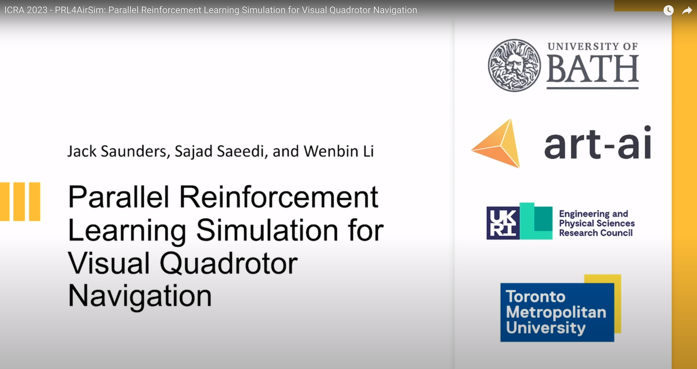
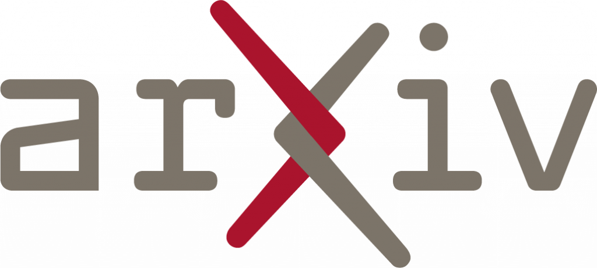
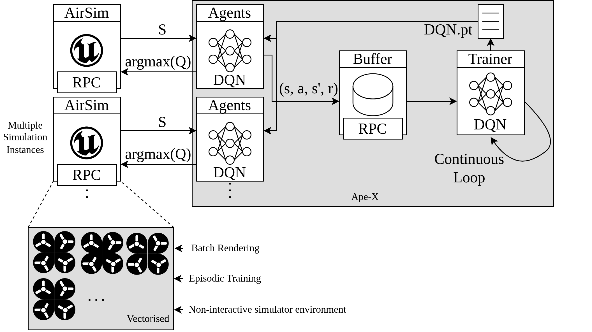
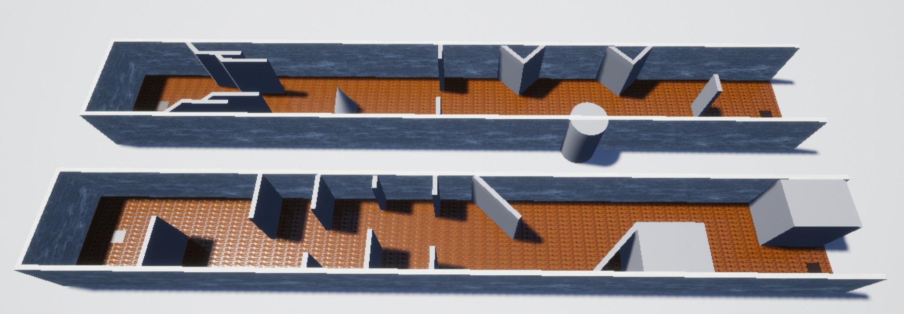
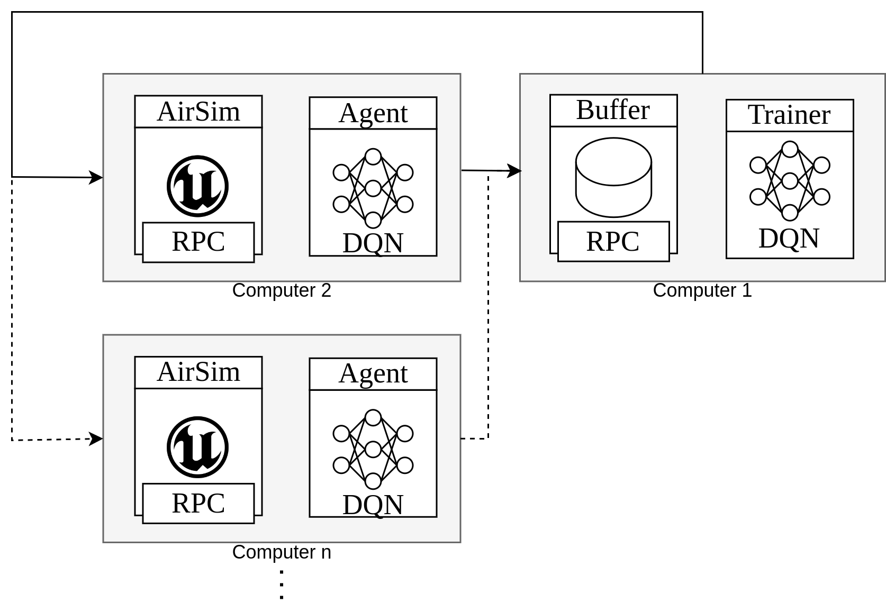
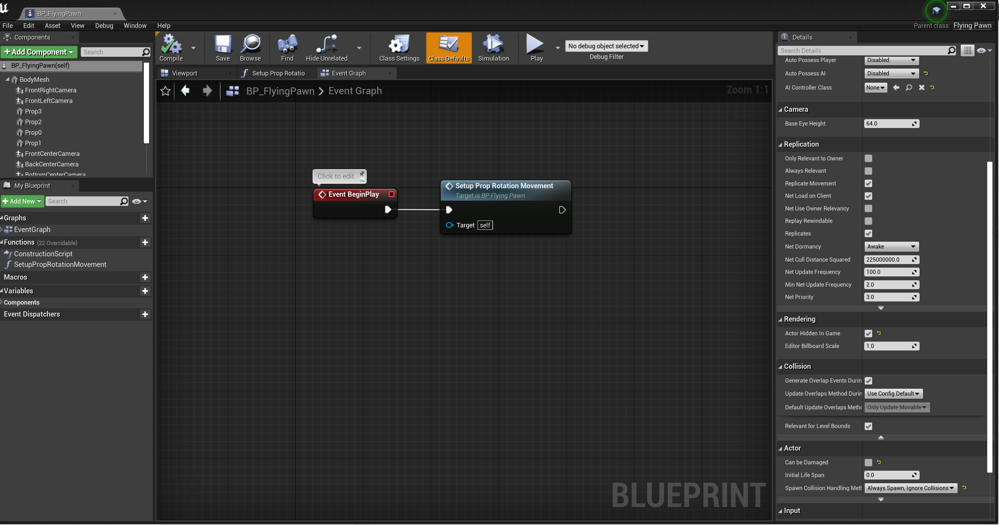
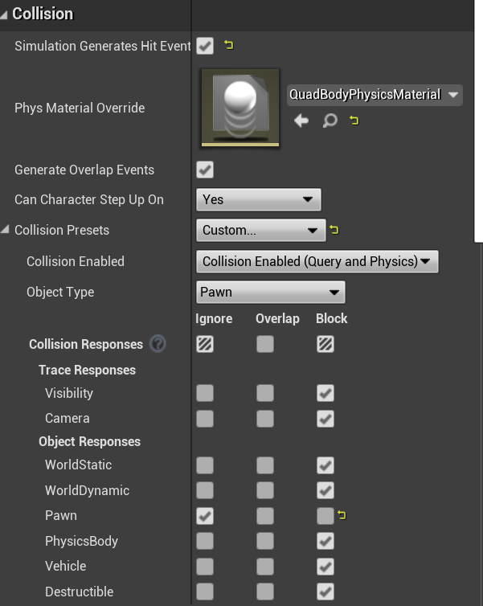
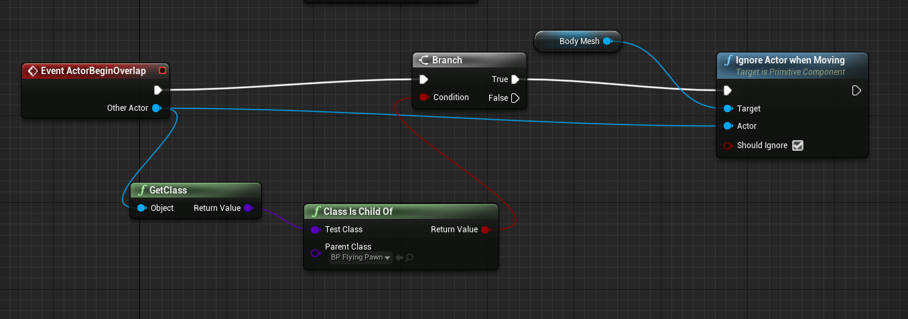

# Welcome to PRL4AirSim

**Currently updating the documentation, hopefully will be done over the next couple of days!**

This project builds on top of [AirSim](https://github.com/microsoft/AirSim) to provide efficient parallel training for Reinforcement Learning controllers.  Check out our 3 minute video bellow which explains our approach.


<p float="left">
  
  &emsp;&emsp;
  <a href="https://www.youtube.com/watch?v=kAWbEUUT8bw">
    
  </a>
</p>

Read our paper (https://arxiv.org/pdf/2209.11094.pdf) and cite us.

```
@article{saunders2022parallel,
    title={Parallel Reinforcement Learning Simulation for Visual Quadrotor Navigation},
    author={Saunders, Jack and Saeedi, Sajad and Li, Wenbin},
    journal={arXiv preprint arXiv:2209.11094},
    year={2022}
}
```

<a href="https://arxiv.org/pdf/2209.11094.pdf">
  
</a>

# What is PRL4AirSim?

PRL4AirSim provides a simulation framework, built on AirSim, which provides efficient parallel training.  We add the following functionality:

1. Batch rendering, to remove multiple game and render thread synchronisation using `simGetBatchImages` to encompas all requests into a single request.
2. Episodic Training, using `resetVehicle` rather than `reset` which causes the entire simulation to reset.
3. Non-interactive simulator environment, removing ego-perspective rendering and agent-agent collision interaction.
4. Ape-X implementation using RPC servers



# Build PRL4AirSim

## Building AirSim
Build AirSim normally.  **Ensure you clone this repository rather than AirSim, then follow their steps as we have modified the AirLib and AirSim plugins.**
- [Windows Build Link](https://microsoft.github.io/AirSim/build_windows)
- [Linux Build Link](https://microsoft.github.io/AirSim/build_linux)
- [MacOS Build Link](https://microsoft.github.io/AirSim/build_macos)

## Install Python Packages

Find the `requirements.txt` file which includes modules used in our python environment and versions.

The required modules are:
- AirSim
- PyTorch
- Numpy
- OpenCV
- wandb (for logging)
- json
- msgpackrpc (https://github.com/tbelhalfaoui/msgpack-rpc-python/tree/fix-msgpack-dep) see bellow

## Correct msgpackRPC installation

msgpack changed its name from msgpack-python to msgpack, which leads to an outdated version installed.  When running the outdated version, the python instance is used rather than the quicker c++ version.  Hence, we need to correct this using `https://github.com/tbelhalfaoui/msgpack-rpc-python/tree/fix-msgpack-dep`.  If Jupyter package is installed, tornado will also be outdated.  This will lead to the following python package versions:

## Binary download

We include a binary which we have used to test this framework.



Download this here: `https://drive.google.com/file/d/1PZxAJjld3xS5QLkC2-lSMHRRsR1VZmP8/view` and place it inside the `PRL4AirSim/UEBinary`.  This should lead to the following file structure:

```
-- PRL4AirSim
---- UEBinary
------ Engine
------ MyProject2
---- Manifest_NonUFSFiles_Linux.txt
---- MyProject2.sh
```

This will be compatible with `start.sh`, now if you want to create your own custom environments, you can compile them and place it in here.  We recommend compiling the project as the UE editor has additional overheads.

# AirSim Configuration

One major disavantage of AirSim is the configuration file for the quadrotors within the simulator.  Every quadrotor requires a specific configuration which leads to thousands of repetitive lines within the configuration file located in `/Documents/AirSim/settings.json`.  In the future we hope to automate the `num_drones` setting in our config to initialise the number of quadrotors on the AirSim side.  However, for now we need this setting (`num_drones`) to match the number of vehicles in the `Documents/AirSim/settings.json` file.  Where each quadrotor id and camera id increments:

```json
{
  "SeeDocsAt": "https://github.com/Microsoft/AirSim/blob/master/docs/settings.md",
  "SimMode": "Multirotor",
  "ViewMode": "NoDisplay",
  "SettingsVersion": 1.2,
  "ClockSpeed": 4.0,
  "LocalHostIp": "127.0.0.1",
  "ApiServerPort": 29001,
  "SubWindows": [],
  "Vehicles": {
    "Drone0": {
      "X": 0,
      "Y": 0,
      "Z": 0,
      "VehicleType": "SimpleFlight",
      "AutoCreate": true,
      "DefaultVehicleState": "Armed",
      "Cameras": {
        "depth_cam_0": {
          "CaptureSettings": [
            {
              "FOV_Degrees": 90,
              "ImageType": 1,
              "Width": 32,
              "Height": 32
            }
          ],
          "Pitch": 0.0,
          "Roll": 0.0,
          "Yaw": 0.0,
          "X": 0.0,
          "Y": 0.0,
          "Z": -0.6
        }
      }
    },
    "Drone1": {
      "X": 0,
      "Y": 0,
      "Z": 0,
      "VehicleType": "SimpleFlight",
      "AutoCreate": true,
      "DefaultVehicleState": "Armed",
      "Cameras": {
        "depth_cam_1": {
          "CaptureSettings": [
            {
              "FOV_Degrees": 90,
              "ImageType": 1,
              "Width": 32,
              "Height": 32
            }
          ],
          "Pitch": 0.0,
          "Roll": 0.0,
          "Yaw": 0.0,
          "X": 0.0,
          "Y": 0.0,
          "Z": -0.6
        }
      }
    }
    ...
  }
}
```

Furthermore, we modify the `ApiServerPort` and `LocalHostIp` setting when running the parallel architecture.  We have a set of templates that can be swapped out to test any number of quadrotors up to 60 (although we have personally tested with 200) in `PRL4AirSim/TemplateConfigurationFiles`.

## PRL4AirSim Configuration

We provide a `config.json` file which contains all parameters of the experiment.  

```json
{
  "max_episodes" : 100000,
  "state_space" : [2, 32, 32],
  "action_space" : 2,
  "buffer_Size": 15000,
  "batch_size" : 32,
  "learning_rate" : 0.001,
  "discount_factor" : 0.95,
  "replace_target_count_episode" : 150,
  "num_drones" : 50,
  "from_artifact" : "",
  "projectName" : "MyProject2",
  "envProcesses" : 1,
  "storage_port" : 29000,
  "headless" : false
}
```

We used this framework to test visual navigation, as a result the state space and action space is specific for this task.  Changing this involves modifying `simulator.py`, `DQNTrainer.py`, and `DQNetwork.py`.

# Running PRL4AirSim

A quick way to test our framework is to use the `start.py` python script, which will run a local version of the PRL4AirSim.  However, we recommend to run all subprocesses on networked computers.

There are four components:

| File      | Description |
| ----------- | ----------- |
| `PRL4AirSim/UEBinary/{ProjectName}.sh`      | AirSim Unreal Engine Binary       |
| `PRL4AirSim/PyClient.py`   | PyClient AirSim Client hosting a local DQN network        |
| `PRL4AirSim/Storage.py`   | Replay Buffer       |
| `PRL4AirSim/Trainer.py`   | Global network parameter trainer      |

Alternatively, we recommend running the airsim and local DQN network on multiple compute units as shown in the figure bellow, thus spreading the GPU and CPU load.  This can be done by running the PyClient and UEBinary remotely, ensuring the IP of the buffer is defined on these machines.  Check out `start.py` on how to do this.  



# PRL4AirSim UnrealEngine and Replay Buffer connection commands

Ape-X enables us to run multiple DQN local instances in parallel (hence parallel RL).  This results in an increased data sample rate from the environmnet.  The bottleneck of AirSim is the high CPU utilisation from the quadrotor dynamics which are calculated every step for each vehicle.  Vectorising the environment can improve memory utilisation 


We have modified the AirLib library to accept new commands that enable vectorised based environment interaction.  Hence, intialise the MultiRotor client normally

**Note: in our code we use client.call(...) without differentiating between the UnrealEngine and Replay buffer.  However, for this documentation simClient means the UnrealEngine client and replayClient is the Replay bufer**

```python
simClient = airsim.MultirotorClient(ue_ip_address : str, ue_port : int)
simClient.confirmConnection()

bufferClient = msgpackrpc.Client(msgpackrpc.Address(buffer_ip_address : str, buffer_port : int))
print(bufferClient.call("confirmConnection"))
```

## PRL4AirSim Agent Simulator Batch commands

```python
simClient.call('simGetBatchImages', requests : [airsim.ImageRequest], vehicle_names : [str])
```

```python
simClient.call_async('moveByVelocityZBatch', vx_vec : [float], vy_vec : [float], z_vec : [float], time : float, driveTrainType : airsim.DrivetrainType, yawMode : airsim.YawMode, vehicle_names : [str])
```

```python
simClient.call('simSetVehiclePoseBatch', poses : [airsim.Pose], vehicle_names : [str])
```

```python
simClient.call_async("resetVehicle", vehicle_name : str, pose : airsim.Pose, orientation : airsim.Quaternionr)
```

**todo**
- more move commands (moveByVelocityBatch(...)

## PRL4AirSim Shared Replay Buffer

Similarly to AirSim, we use a RPC server to host the replay buffer.  This buffer is a centralised storage used by the local agent instances to fill experiences to, and an external trainer client which samples experiences.

```python
def pushMemory(self, state, action, next_state, reward, not_done)
```

```python
# For Epislon-Greedy action selection, epsilon can decrement with the size of the experience replay.
def getMemoryPushCounter(self)
```

```python
# There is a delay between when the replay buffer starts and when agents start interacting with the environment.
# We use this to properly define when the experiment starts.
def startSimulation(self)
```

```python
# Used to track episodic training
def finishEpisode(self)
```

```python
# The trainer calls this to sample experiences from the buffer.  We store experiences as a dictionary of numpy arrays 
# which need to be converted to python lists for the RPC server to encode and sent to the trainer client.  See 'Utils.convertStateDicToListDic()'
def sampleFromStorage(self)
```

# Non-interactive Unreal Engine Custom Environments

We provide the environment presented within the paper to allow others to validate our approach.  However, to create a custom environment, we recomend you follow the following steps to prevent agent interaction.

## Remove ego-perspective rendering of other quadrotors

To make the quadrotor invisible in the scene, change the 'Hidden in Scene Capture' to True.  This will make it invisible to other drones but the spectator actor can still see it.  Go to details, then rendering, this will show the setting 'ACtor Hidden In Game'.




## Remove Collision boxes from all agents within the environment

We need to specifically remove agent-agent interaction while also enabling environment interaction.  Hence we need to define all components of the quadrotor blueprint 'BP_FlyingPawn' as 'Pawn' and ignore any overlaps that occour between this group.  To do this, we modify the collision response within the agent blueprint.

There are five components to change within the 'BP_FlyingPawn' blueprint: BodyMesh, Prop3, Prop2, Prop1, Prop0.  For all of these, go to collisions, then change the collision presents to custom.  Thange the Object Type to 'Pawn' and then in 'Object Responses' change the Pawn to Ignore as shown bellow.




Now to remove collisions between 'Pawns', we need to ignore the event 'ActorBeginOverlap' which we can do using a Blueprint Event Graph.  Add the following event graph to 'BP_FlyingPawn'.




Agents will interact with the environment without interacting with each other.


# Potential Issues and Confusions

1. Correct installation of RPC library.

2. DQNetwork and DQNTrainer used for both the PyClient and Trainer

In the future we will break the functionality of both the DQNetwork and DQNTrainer to make it clearer what functions are used for each. 

3. AirSim and UnrealEngine Coordinate Reference Frame

The reference frame in AirSim is centered around the player start actor.  To spawn agents at certain locations, we capture the position within the unreal engine and then transpose it to the AirSim frame.  Use the function 'convert_pos_UE_to_AS' to convert between UE and AS in Utils.py

```python
def convert_pos_UE_to_AS(origin_UE : np.array, pos_UE : np.array):
```

# Contact us
```
Jack Sanders: JS3442@bath.ac.uk
Sajad Saeedi: s.saeedi@ryerson.ca
Wenbin Li: W.Li@bath.ac.uk
```

---
