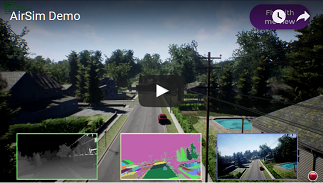
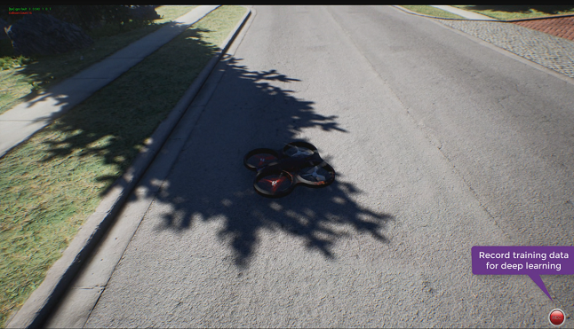
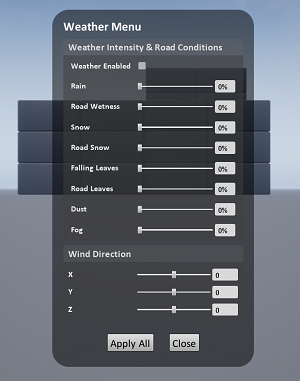

# Welcome to AirSim

AirSim is a simulator for drones, cars and more, built on [Unreal Engine](https://www.unrealengine.com/) (we now also have an experimental [Unity](https://unity3d.com/) release). It is open-source, cross platform, and supports hardware-in-loop with popular flight controllers such as PX4 for physically and visually realistic simulations. It is developed as an Unreal plugin that can simply be dropped into any Unreal environment. Similarly, we have an experimental release for a Unity plugin. 

Our goal is to develop AirSim as a platform for AI research to experiment with deep learning, computer vision and reinforcement learning algorithms for autonomous vehicles. For this purpose, AirSim also exposes APIs to retrieve data and control vehicles in a platform independent way.

**Check out the quick 1.5 minute demo**

Drones in AirSim

[](https://youtu.be/-WfTr1-OBGQ)

Cars in AirSim

[](https://youtu.be/gnz1X3UNM5Y)

## What's New

* Added support for [docker in ubuntu](https://microsoft.github.io/AirSim/docs/docker_ubuntu) 
* Added Weather Effects and [APIs](https://microsoft.github.io/AirSim/docs/apis#weather-apis)
* Added [Time of Day API](https://microsoft.github.io/AirSim/docs/apis#time-of-day-api)
* An experimental integration of [AirSim on Unity](https://github.com/Microsoft/AirSim/tree/master/Unity) is now available. Learn more in [Unity blog post](https://blogs.unity3d.com/2018/11/14/airsim-on-unity-experiment-with-autonomous-vehicle-simulation).
* [New environments](https://github.com/Microsoft/AirSim/releases/tag/v1.2.1): Forest, Plains (windmill farm), TalkingHeads (human head simulation), TrapCam (animal detection via camera)
* Highly efficient [NoDisplay view mode](https://microsoft.github.io/AirSim/docs/settings#viewmode) to turn off main screen rendering so you can capture images at high rate
* [Lidar Sensor](https://microsoft.github.io/AirSim/docs/lidar)
* Case Study: [Formula Student Technion Driverless](https://github.com/Microsoft/AirSim/wiki/technion)
* [Multi-Vehicle Capability](https://microsoft.github.io/AirSim/docs/multi_vehicle)
* [ROS publisher](https://github.com/Microsoft/AirSim/pull/1135)

For complete list of changes, view our [Changelog](CHANGELOG.md)

## How to Get It

### Windows
* [Download binaries](https://microsoft.github.io/AirSim/docs/use_precompiled)
* [Build it](https://microsoft.github.io/AirSim/docs/build_windows)

### Linux
* [Build it](https://microsoft.github.io/AirSim/docs/build_linux)

[](https://travis-ci.org/Microsoft/AirSim)

## How to Use It

### Documentation

View our [detailed documentation](https://microsoft.github.io/AirSim/) on all aspects of AirSim.

### Manual drive

If you have remote control (RC) as shown below, you can manually control the drone in the simulator. For cars, you can use arrow keys to drive manually.

[More details](https://microsoft.github.io/AirSim/docs/remote_control/)


### Programmatic control

AirSim exposes APIs so you can interact with the vehicle in the simulation programmatically. You can use these APIs to retrieve images, get state, control the vehicle and so on. The APIs are exposed through the RPC, and are accessible via a variety of languages, including C++, Python, C# and Java.

These APIs are also available as part of a separate, independent cross-platform library, so you can deploy them on a companion computer on your vehicle. This way you can write and test your code in the simulator, and later execute it on the real vehicles. Transfer learning and related research is one of our focus areas.

Note that you can use [SimMode setting](https://microsoft.github.io/AirSim/docs/settings#simmode) to specify the default vehicle or the new [ComputerVision mode](https://microsoft.github.io/AirSim/docs/image_apis#computer-vision-mode-1) so you don't get prompted each time you start AirSim.

[More details](https://microsoft.github.io/AirSim/docs/apis/)

### Gathering training data

There are two ways you can generate training data from AirSim for deep learning. The easiest way is to simply press the record button in the lower right corner. This will start writing pose and images for each frame. The data logging code is pretty simple and you can modify it to your heart's content.



A better way to generate training data exactly the way you want is by accessing the APIs. This allows you to be in full control of how, what, where and when you want to log data. 

### Computer Vision mode

Yet another way to use AirSim is the so-called "Computer Vision" mode. In this mode, you don't have vehicles or physics. You can use the keyboard to move around the scene, or use APIs to position available cameras in any arbitrary pose, and collect images such as depth, disparity, surface normals or object segmentation. 

[More details](https://microsoft.github.io/AirSim/docs/docs/image_apis/)

### Weather Effects

Press F10 to see various options available for weather effects. You can also control the weather using [APIs](https://microsoft.github.io/AirSim/docs/apis#weather-apis). Press F1 to see other options available.



## Tutorials

- [Video - Setting up AirSim with Pixhawk Tutorial](https://youtu.be/1oY8Qu5maQQ) by Chris Lovett
- [Video - Using AirSim with Pixhawk Tutorial](https://youtu.be/HNWdYrtw3f0) by Chris Lovett
- [Video - Using off-the-self environments with AirSim](https://www.youtube.com/watch?v=y09VbdQWvQY) by Jim Piavis
- [Reinforcement Learning with AirSim](https://microsoft.github.io/AirSim/docs/reinforcement_learning) by Ashish Kapoor
- [The Autonomous Driving Cookbook](https://aka.ms/AutonomousDrivingCookbook) by Microsoft Deep Learning and Robotics Garage Chapter
- [Using TensorFlow for simple collision avoidance](https://github.com/simondlevy/AirSimTensorFlow) by Simon Levy and WLU team

## Participate

### Paper

More technical details are available in [AirSim paper (FSR 2017 Conference)](https://arxiv.org/abs/1705.05065). Please cite this as:
```
@inproceedings{airsim2017fsr,
  author = {Shital Shah and Debadeepta Dey and Chris Lovett and Ashish Kapoor},
  title = {AirSim: High-Fidelity Visual and Physical Simulation for Autonomous Vehicles},
  year = {2017},
  booktitle = {Field and Service Robotics},
  eprint = {arXiv:1705.05065},
  url = {https://arxiv.org/abs/1705.05065}
}
```

### Contribute

Please take a look at [open issues](https://github.com/microsoft/airsim/issues) if you are looking for areas to contribute to.

* [More on AirSim design](https://microsoft.github.io/AirSim/docs/design)
* [More on code structure](https://microsoft.github.io/AirSim/docs/code_structure)
* [Contribution Guidelines](CONTRIBUTING.md)
* [Trello Board](https://trello.com/b/1t2qCeaA/wishlist-by-community-for-community)

### Who is Using AirSim?

We are maintaining a [list](https://microsoft.github.io/AirSim/docs/who_is_using) of a few projects, people and groups that we are aware of. If you would like to be featured in this list please [make a request here](https://github.com/microsoft/airsim/issues).

## Contact

Join the AirSim group on [Facebook](https://www.facebook.com/groups/1225832467530667/) to stay up to date or ask any questions.

## FAQ

If you run into problems, check the [FAQ](https://microsoft.github.io/AirSim/docs/faq) and feel free to post issues in the  [AirSim](https://github.com/Microsoft/AirSim/issues) repository.

## License

This project is released under the MIT License. Please review the [License file](LICENSE) for more details.
