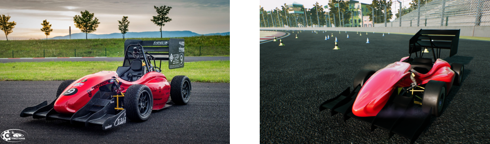
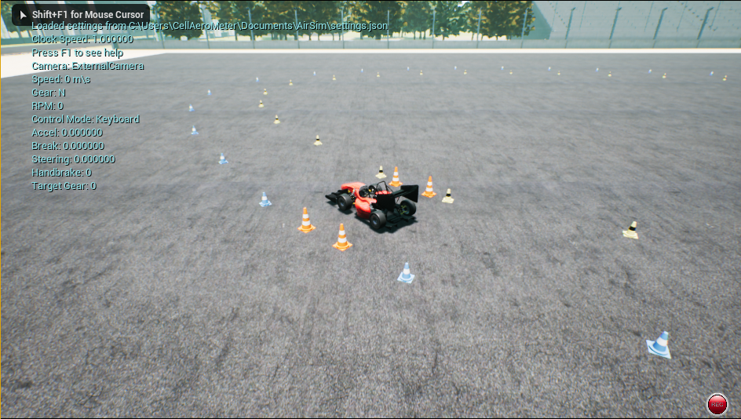

# Formula Student Technion Driverless - Based on AirSim

To view AirSim git and the original README, please go to [AirSim git](https://github.com/Microsoft/AirSim).

This project is about training and implementing self-driving algorithm for Formula Student Driverless competitions. In such competitions, a formula race car, designed and built by students, is challenged to drive through previously unseen tracks that are marked by traffic cones.  
We present a simulator for formula student car and the environment of a driverless competition. The simulator is based on AirSim.  

  
*The Technion Formula Student car. Actual car (left), simulated car (right)*  

AirSim is a simulator for drones, cars and more built on Unreal Engine. It is open-source, cross platform and supports hardware-in-loop with popular flight controllers such as PX4 for physically and visually realistic simulations. It is developed as an Unreal plugin that can simply be dropped in to any Unreal environment you want.  

Our goal is to provide a platform for AI research to experiment with deep learning, in particular imitation learning, for Formula Student Driverless cars.  

The model of the Formula Student Technion car is provided by [Ryan Pourati](https://www.linkedin.com/in/ryanpo).

The environment scene is provided by [PolyPixel](https://www.polypixel3d.com/).

  
*Driving in real-world using trained imitation learning model, based on AirSim data only*  

## Prerequisites

* Operating system: Windows 10
* GPU: Nvidia GTX 1080 or higher (recommended)
* Software: Unreal Engine 4.18 and Visual Studio 2017 (see [upgrade instructions](docs/unreal_upgrade.md))
* Note: This repository is forked from AirSim 1.2

## How to Get It

### Windows
* [Build it](docs/build_FSTDriverless_windows.md)

## How to Use It

### Choosing the Mode: Car, Multirotor or ComputerVision
By default AirSim will prompt you for choosing Car or Multirotor mode. You can use [SimMode setting](docs/settings.md#simmode) to specify the default vehicle to car (Formula Technion Student car).

### Manual drive

If you have a steering wheel (Logitech G920) as shown below, you can manually control the car in the simulator. Also, you can use arrow keys to drive manually.

[More details](docs/steering_wheel_installation.md)

### Steering the car using imitation learning

Using imitation learning, we trained a deep learning model to steer a Formula Student car with an input of only one camera. Our code files for the training procedure are available [here](https://github.com/FSTDriverless/AirSim/tree/master/PythonClient/imitation_learning) and are based on [AirSim cookbook](https://github.com/Microsoft/AutonomousDrivingCookbook).

### Gathering training data

We added a few [graphic features](docs/graphic_features.md) to ease the procedure of recording data.  
You can change the positions of the cameras using [this](docs/cameras_positioning.md) tutorial.  

There are two ways you can generate training data from AirSim for deep learning. The easiest way is to simply press the record button on the lower right corner. This will start writing pose and images for each frame. The data logging code is pretty simple and you can modify it to your heart's desire.

A better way to generate training data exactly the way you want is by accessing the APIs. This allows you to be in full control of how, what, where and when you want to log data. 

### Formula Student Technion algorithm team

[Tom Hirshberg](https://www.linkedin.com/in/tom-hirshberg-93935b16b/), [Dean Zadok](https://www.linkedin.com/in/dean-zadok-36886791/) and [Amir Biran](https://www.linkedin.com/in/amir-biran-199891125/).  

### Acknowledgments  

We would like to thank our advisors: Dr. Kira Radinsky, Dr. Ashish Kapoor and Boaz Sternfeld.  
Thanks to the Intelligent Systems Lab (ISL) in the Technion for the support.
