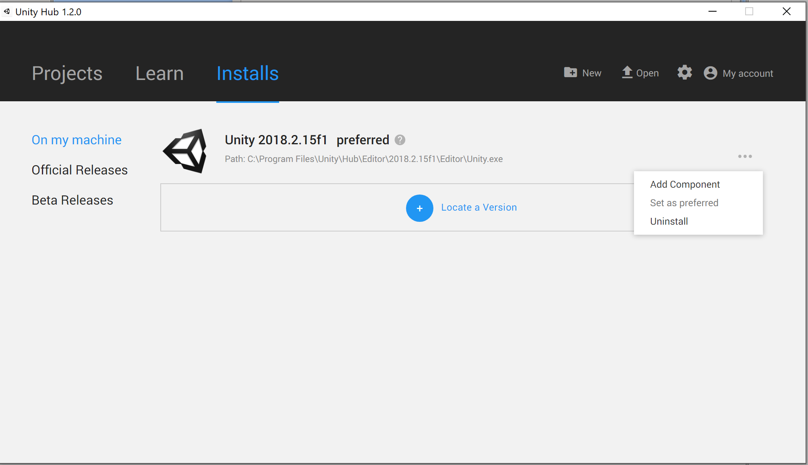

# AirSim on Unity

* AirSim on Unity allows you to run your simulators in the [Unity Engine](https://unity3d.com/). This project comes with some sample Unity projects and a wrapper around the AirLib library to run as a [native plugin](https://docs.unity3d.com/Manual/NativePlugins.html) in Unity. 
* Included are two basic Unity Projects, one for a Car simulator and another for a Drone simulator. They are meant to be lightweight, and can be used to verify your setup is correct. 
* Check out the [Unity blogpost](https://blogs.unity3d.com/2018/11/14/airsim-on-unity-experiment-with-autonomous-vehicle-simulation/) for overview on the release.  

### Warning: Experimental Release
This project is still in early development, expect some rough edges. We are working to fully support the full AirLib API and feature set, but some things may be missing. [Click here](unity_api_support.md) for the list of currently supported APIs.

## Windows
### Building from source
#### Install Unity
* Download **Unity Hub** from [this page](https://unity3d.com/get-unity/download). 
* Install **Unity 2018.2.15f1** using the Unity Hub. [Detailed instructions here](https://docs.unity3d.com/Manual/GettingStartedInstallingHub.html). 
* Note: If you are using Unity for the first time, check out [the Getting started guide](https://docs.unity3d.com/Manual/GettingStarted.html). The [Unity User Manual](https://docs.unity3d.com/Manual/UnityManual.html) has additional tips, resources, and FAQs.

#### Build Airsim
* Install Visual Studio 2017. 
**Make sure** to select **VC++** and **Windows SDK 8.1** while installing VS 2017.   

* Start `x64 Native Tools Command Prompt for VS 2017`. 
* Clone the repo: `git clone https://github.com/Microsoft/AirSim.git`, and go the AirSim directory by `cd AirSim`. 
* Run `build.cmd` from the command line. 

#### Build Unity Project
* Go inside the AirSim\Unity directory: `cd Unity`. 
* Build the unity project: `build.cmd`.   
* Additionally, there is a free environment `Windridge City` which you can download from [Unity Asset Store](https://assetstore.unity.com/packages/3d/environments/roadways/windridge-city-132222). And, of course, you can always create your own environment.

## Linux
#### Dependencies
```
sudo apt-get install libboost-all-dev
```
#### Download and Install Unity for Linux
<span style="color:red">Warning:</span> Unity Editor for Linux is still in Beta. Expect some rough edges.

* **Download** Unity editor version `2019.1.0f2`
	```shell
	wget https://beta.unity3d.com/download/292b93d75a2c/UnitySetup-2019.1.0f2
	```
	Note: While the latest version of linux build of Unity can be found on the last post of [this thread](https://forum.unity.com/threads/unity-on-linux-release-notes-and-known-issues.350256/page-2#post-4458286), we recommend `2019.1.0f2`.

* **Install** the editor
	```shell
	chmod +x UnitySetup-2019.1.0f2
	./UnitySetup-2019.1.0f2
	```

#### Build Airsim
```
git clone https://github.com/Microsoft/AirSim.git;
cd AirSim;
./setup.sh;
./build.sh
```

#### Generate AirsimWrapper Shared Library
```
cd AirSim/Unity
./build.sh
```

This will generate the necessary shared library and copy it to the UnityDemo Plugins folder.

## Usage 
* Start Unity and click `Open project`. 
* Select the folder `AirSim\Unity\UnityDemo`, and then hit the button `Select Folder`. 
* In the bottom pane, Click on `Projects`->`Assets`->`Scenes`. Then, **Double-click** on `SimModeSelector`. This will load the SimModeSelector scene into the scene hierarchy pane. *DO NOT* add CarDemo or DroneDemo scene into the scene hierarchy pane.
* Hit the play button to start the simulation (and hit play again to stop the simulation. .  
* Alternatively, you can change the SimMode in your `Settings.json` file. (You can read more about [`Settings.json` here](https://github.com/Microsoft/AirSim/blob/master/docs/settings.md))
* Controlling the car:    
Use `WASD` or the `Arrow keys` or the AirSim client.   
* Controlling the drone:    
Keyboard control is not currently available for drone flight.
* Changing camera views:    
Keys `0`, `1`, `2`, `3` are used to toggle windows of different camera views.
* Recording simulation data:    
Press *Record* button(Red button) located at the right bottom corner of the screen, to toggle recording of the simulation data. The recorded data can be found at `Documents\AirSim\(Date of recording)` on Windows and `~/Documents/AirSim/(Date of recording)` on Linux.
## Building Custom Environments For AirSim
To use environments other than `UnityDemo`, follow the instructions written [here](custom_unity_environments.md)
## Cross-Compiling to Linux
Unity Editor supports compiling projects to Linux systems.
After following the steps to build AirSim and Unity on Windows, do the following:

#### Linux Pre-Requisites
Before being able to run Unity Binaries with the Airsim plugin, be sure have airsim and airsim unity built on your linux machine by following the Linux build steps above.

### Package UnityDemo Binary On Windows

#### Install Necessary Components
In order to package your project for linux, the **Linux Build Support** Unity add-on must be installed.
* Open **Unity Hub**, and click the **Add component** button in the dropdown window under **more options** to the right of your **Unity 2018.2.15f1** tab.

* Make sure the **Linux Build Support** Platform is selected

Once this component is successfully installed, you are ready to build Unity Projects for Linux!

#### Build the Project
* On your Windows machine, build the Unity Demo by navigating to the build settings option in the toolbar ```File -> Build Settings```
* Make sure the following scenes are set to be built:
	1. SimModeSelector
	2. CarDemo
	3. DroneDemo
* Set the target operating system to linux, and choose the version appropriate for your system (x86 vs x86_64)
* Click ```Build```
* Transport the built project as well as the generated folder ```"{project_name}_Data"``` to your linux machine

#### Copy The AirsimWrapper Library to the Project Plugins folder
* On your linux machine, navigate to your AirSim repository, and run the following commands in a terminal window:
	```
	cp Unity/linux-build/libAirsimWrapper.so path/to/your/project/{project_name}_Data/Plugins/{os_version}
	```
This will generate the necessary shared library to allow Airsim to communicate with Unity and copy it to the plugins folder of your project binary.

#### Run the Project Binary
* Open a terminal and navigate to your project directory
* Set your project binary as an executable file:
```
chmod +x "{project_name}.{configuration}"
```
* Run the binary file
```
./{project_name}.{configuration}
```
### Using Airsim API
* For quickstart with the Python APIs for the car or the drone, simply run the [`hello_car.py`](https://github.com/Microsoft/AirSim/blob/master/PythonClient/car/hello_car.py) or the [`hello_drone.py`](https://github.com/Microsoft/AirSim/blob/master/PythonClient/multirotor/hello_drone.py) script accordingly. 
* Details of the AirSim C++ and Python APIs are [here](https://github.com/Microsoft/AirSim/blob/master/docs/apis.md). 

### Acknowledgements
* The drone object was provided by user 31415926 on [sketchfab](https://sketchfab.com/models/055841df0fb24cd4abde06a91f7d360a). It is licensed under the [CC License](https://creativecommons.org/licenses/by/4.0/).
