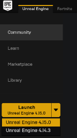

# How To Build and Install
**Make sure you have read the [prerequisites](docs/prereq.md).**

## Install Unreal Engine
  1. Download Unreal 4 engine from [unreal.com](https://www.unrealengine.com/dashboard). While Unreal Engine is open source, cross platform and free to download, registration is still required as of this writing. You need version 4.14 or higher.
  2. After download, run Epic Game Launcher and click the big yellow "Install" button under Unreal Engine tab. .

## Get the code and build
  1. You need Visual Studio 2015 Update 3 (make sure to install VC++). Other versions haven't been tested.
  2. Start VS2015 x64 Native Tools Command Prompt. Create a folder for repo and run
  `git clone https://github.com/Microsoft/AirSim.git`
  3. Run `build`. If everything goes fine, you should have all binaries you need.

## Create Unreal Environment
To run the simulator, you need environment and its very easy to create one! [Unreal Marketplace](https://www.unrealengine.com/marketplace) has dozens of prebuilt extra-ordinarily detailed [environments](https://www.unrealengine.com/marketplace/content-cat/assets/environments) ranging from Moon to Mars and everything in between. The one we have used for testing our code is called [Modular Neighborhood Pack](https://www.unrealengine.com/marketplace/modular-neighborhood-pack) but you can use any environment.
  1. Either purchase an environment from Unreal Marketplace or choose one of the free ones such as [Infinity Blade series](https://www.unrealengine.com/marketplace/infinity-blade-plain-lands). Alternatively, if you look under the Learn tab in Epic Game Launcher, you will find many free samples you can use. One of our favorite is, of course, "A Boy and His Kite" which is 100 square mile of highly detailed environment (causion: you will need *very* beefy specs to run it!).
  2. Once you have invironment, you can simply go to Library tab of Epic Game Launcher and add in to any project you like. We recommand creating a new black C++ project with no Starter Content and add your environment in to it.
  6. Go to your Unreal project's folder, create a folder "Plugins
  7. Alternatively, you can also launch Unreal Project Browser from "C:\Program Files (x86)\Epic Games\4.xx\Engine\Binaries\Win64\UE4Editor.exe".