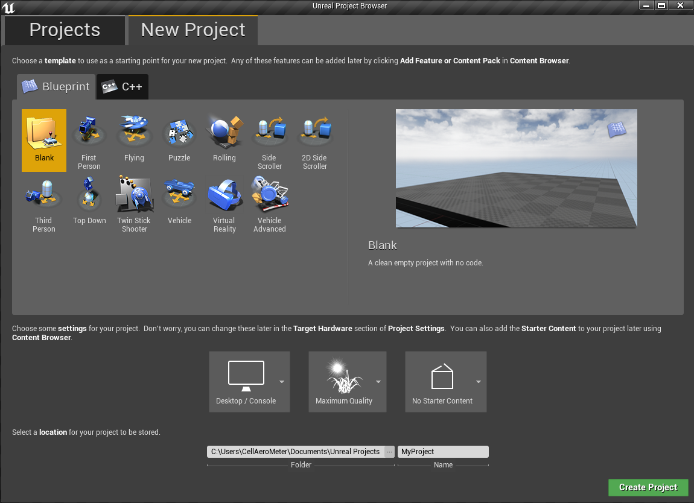

# Build AirSim with FST Driverless Environment on Windows

## Install Unreal Engine

1. [Download](https://www.unrealengine.com/download) the Epic Games Launcher. While the Unreal Engine is open source and free to download, registration is still required.
2. Run the Epic Games Launcher, open the Library tab from left, click on the "Add Versions" which should show the option to download Unreal 4.18 as shown below. If you have multiple versions of Unreal installed then make sure 4.18 is "Current" by clicking down arrow next to the Launch button for the version.

   **Note**: This project works only with UE 4.18. If you have UE 4.16 or older projects, please see the [upgrade guide](unreal_upgrade.md) to upgrade your projects.

## Build AirSim

  1. You will need Visual Studio 2017 (**make sure** to install VC++ and Windows SDK 8.x).
  2. Start `x64 Native Tools Command Prompt for VS 2017`. Create a folder for the repo and run `git clone https://github.com/Microsoft/AirSim.git`.
  3. Run `build.cmd` from the command line. This will create ready to use plugin bits in the `Unreal\Plugins` folder that can be dropped into any Unreal project.

## Creating and Setting Up Unreal Environment

Finally, you will need an Unreal project that hosts the environment for your vehicles. Follow the list below to create an environment that simulates the FSD competitions.
1. Make sure AirSim is built and Unreal 4.18 is installed as described above.
2. Open UE editor and choose "New Project". Choose "Blank" with no starter content. Select your project's location, define it's name (`ProjectName` for example) and press "create project".



3. After the project is loaded to the editor, from the `File menu` select `New C++ class`, leave default `None` on the type of class, click `Next`, leave default name `MyClass`, and click `Create Class`. We need to do this because Unreal requires at least one source file in project. It should trigger compile and open up Visual Studio solution `ProjectName.sln`.

4. Close and save `ProjectName.sln`. Also, close the UE editor.

5. Go to your folder for AirSim repo and copy `Unreal\Plugins` folder into your `ProjectName` folder. This way now your own Unreal project has AirSim plugin.

6. Download the environment assets of FSD racecourse from [here](https://drive.google.com/file/d/1FC1T8rZ5hVEDXwlECnPxmPitRCLlxGma/view?usp=sharing). Extract the zip into `ProjectName\Content` (see folders tree in the end of this doc).

7. Download the formula Technion car assets from [here](https://drive.google.com/file/d/1dV4deyLlmMwBwA2ljxbardbGdXHtKKSo/view?usp=sharing). Extract the zip into `ProjectName\Plugins\AirSim\Content\VehicleAdv\SUV` and select `replace` when asked for `SuvCarPawn.uasset` (the original file will be saved into a backup folder).

8. Edit the `ProjectName.uproject` so that it looks like this:
Notice that we called the project `ProjectName` in case you need to change it.

```
{
	"FileVersion": 3,
	"EngineAssociation": "4.18",
	"Category": "Samples",
	"Description": "",
	"Modules": [
		{
			"Name": "ProjectName",
			"Type": "Runtime",
			"LoadingPhase": "Default",
			"AdditionalDependencies": [
				"AirSim"
			]
		}
	],
	"TargetPlatforms": [
		"MacNoEditor",
		"WindowsNoEditor"
	],
	"Plugins": [
		{
			"Name": "AirSim",
			"Enabled": true
		}
	]
}
```

9. Right click the `ProjectName.uproject` in Windows Explorer and select Generate Visual Studio Project Files. This step detects all plugins and source files in your Unreal project and generates .sln file for Visual Studio.


Tip: If the `Generate Visual Studio Project Files` option is missing you may need to reboot your machine for the Unreal Shell extensions to take effect.  If it is still missing then open the `ProjectName.uproject` in the Unreal Editor and select `Refresh Visual Studio Project` from the `File` menu.

10. Reopen `ProjectName.sln` in Visual Studio, and make sure "DebugGame Editor" and "Win64" build configuration is the active build configuration.


11. Press `F5` to `debug`. This will start the Unreal Editor. The Unreal Editor allows you to edit the environment, assets and other game related settings. 

12. First thing, load a map to set your environment. The maps are under `Content\RaceCourse\Maps`. To choose one of the maps double-click on it.

13. In `Window/World Settings` as shown below, set the `GameMode Override` to `AirSimGameMode`:


14. Next, if you want to change the location of `PlayerStart` object in your environment(`PlayerStart` object already exist) you can find and fix it in the `World Outliner`. This is where AirSim plugin will create and place the vehicle. If its too high up then vehicle will fall down as soon as you press play giving potentially random behavior.


15. Go to 'Edit->Editor Preferences' in Unreal Editor, in the 'Search' box type 'CPU' and ensure that the 'Use Less CPU when in Background' is unchecked. If you don't do this then UE will be slowed down dramatically when UE window loses focus.

16. Be sure to `Save` these edits. Hit the Play button in the Unreal Editor. See [how to use AirSim](https://github.com/Microsoft/AirSim/#how-to-use-it).

Ready... Set... GO!!!
You are now running AirSim in your FSD Unreal environment.

## Setup Steering Wheel (Logitech G920)

A steering wheel is required if you want to drive manually. See the [steering wheel instructions](steering_wheel_installation.md) for more details.

Alternatively, you can use [APIs](apis.md) for programmatic control or use the so-called [Computer Vision mode](image_apis.md) to move around using the keyboard.
