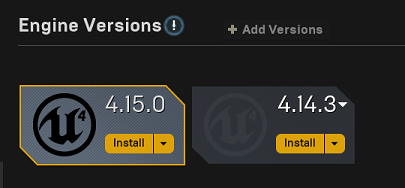

# Build AirSim on Windows

## Install Unreal Engine

1. [Download](https://www.unrealengine.com/download) the Epic Games Launcher. While the Unreal Engine is open source and free to download, registration is still required.
2. Run the Epic Games Launcher, open the Library tab from left, click on the "Add Versions" which should show the option to download Unreal 4.16 as shown below. If you have multiple versions of Unreal installed then make sure 4.16 is "Current" by clicking down arrow next to the Launch button for the version.

   **Note**: Older versions of Unreal are not supported. Please see the [upgrade guide](unreal_upgrade.md) to upgrade your projects.

   

## Build AirSim

  1. You will need Visual Studio 2015 Update 3 (make sure to install VC++) or newer. Other versions haven't been tested.
  2. Start VS2015 x64 Native Tools Command Prompt. Create a folder for the repo and run `git clone https://github.com/Microsoft/AirSim.git`.
  3. Install [CMake](https://cmake.org/download/) which is used to build the rpclib submodule.
  4. Run `build.cmd` from the command line. This will create ready to use plugin bits in the `Unreal\Plugins` folder that can be dropped into any Unreal project.

## Setup Remote Control

A remote control is required if you want to fly manually. See the [remote control setup](remote_control.md) for more details.

Alternatively, you can use [APIs](apis.md) for programmatic control or use the so-called [Computer Vision mode](image_apis.md) to move around using the keyboard.

## Setup Unreal Environment

Finally, you will need an Unreal project that hosts the environment for your vehicles. AirSim comes with a built-in "Blocks Environment" which you can use, or you can create your own. Please see [setting up Unreal Environment](unreal_proj.md).

## FAQ

#### How do I use PX4 firmware with AirSim?
By default, AirSim uses its own built-in firmware called [simple_flight](simple_flight.md). There is no additional setup if you just want to go with it. If you want to switch to using PX4 instead then please see [this guide](px4_setup.md).

#### Build is not working on VS 2017
Known working config is:
````
Windows 10 (Education) x64
VS2015 update 3 (x86) with VC++
Cmake 3.7 (x86)
````
Even though cmake 3.7 says it added support for VS 2017 folks are reporting build issues with that.

#### I made changes in Visual Studio but there is no effect

Sometimes the Unreal + VS build system doesn't recompile if you make changes to only header files. To ensure a recompile, make some cpp file "dirty".
