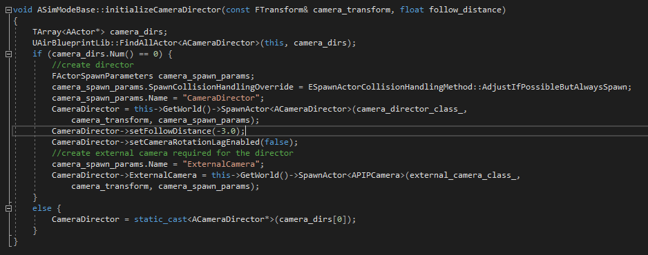
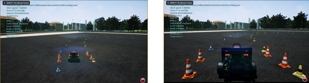
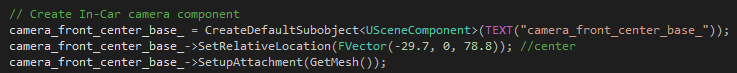
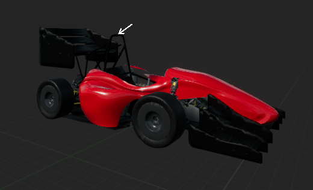

# Cameras Positioning  

In AirSim, we have several cameras. One of them is in charge of following the vehicle, while the others are in charge of recording the data for training.  

This section will show how to change the position of these cameras, using the code.  
We did two changes:  
1. We changed the distance of the following camera to get a better view on our car.  
2. We changed the position of the recording camera to be in same position as our actual camera on the real car.  

## Following the car  

To change the distance of the camera that follows the car, select the file SimModeBase.cpp from the visual studio console.  
In line 309, change the value follow_distance: to move closer, increase this number and to move farther, decrease this number.  
In our project, we used the value -3.0.  

  

  
*Before and after changing the following distance*  

## Recording data  

To change the position of the camera that is resposible for recording data, select the file CarPawn.cpp from the visual studio console.  
In line 43, change the values of the relative location vector of the camera_front_center_base_ to be (-29.7, 0, 78.8).  
In our case, this is exactly the position of the upper pole in the chassis.  

  

  
*The position of our camera, marked with a white arrow*  

### Tip  

As mentioned in [imitation learning](https://github.com/FSTDriverless/AirSim/tree/master/PythonClient/imitation_learning), we shifted the Y axis to record different poses on the track while driving. This helped us to train examples of getting back to the center of the track. You can try different approaches as well.  
