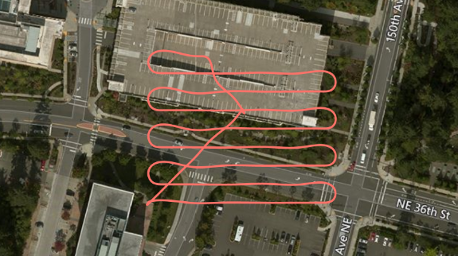

# Implementing a Drone Survey script

Moved here from [https://github.com/microsoft/AirSim/wiki/Implementing-a-Drone-Survey-script](https://github.com/microsoft/AirSim/wiki/Implementing-a-Drone-Survey-script)

Ever wanted to capture a bunch of top-down pictures of a certain location? Well, the Python API makes this really simple.  See the [code available here](https://github.com/microsoft/AirSim/blob/master/PythonClient/multirotor/survey.py).



Let's assume we want the following variables:

| Variable      | Description |
| ------------- | ------------- |
| boxsize  | The overall size of the square box to survey |
| stripewidth | How far apart to drive the swim lanes, this can depend on the type of camera lens, for example. |
| altitude | The height to fly the survey. |
| speed | The speed of the survey can depend on how fast your camera can snap shots. |

So with these we can compute a square path box using this code:

```python
        path = []
        distance = 0
        while x < self.boxsize:
            distance += self.boxsize
            path.append(Vector3r(x, self.boxsize, z))
            x += self.stripewidth
            distance += self.stripewidth
            path.append(Vector3r(x, self.boxsize, z))
            distance += self.boxsize
            path.append(Vector3r(x, -self.boxsize, z))
            x += self.stripewidth
            distance += self.stripewidth
            path.append(Vector3r(x, -self.boxsize, z))
            distance += self.boxsize
```
Assuming we start in the corner of the box, increment x by the stripe width, then fly the full y-dimension of `-boxsize` to `+boxsize`, so in this case, `boxsize` is half the size of the actual box we will be covering.

Once we have this list of Vector3r objects, we can fly this path very simply with the following call:
```python
result = self.client.moveOnPath(path, self.velocity, trip_time, DrivetrainType.ForwardOnly,
                                YawMode(False,0), lookahead, 1)
```

We can compute an appropriate `trip_time` timeout by dividing the distance of the path and the speed we are flying.

The `lookahead` needed here for smooth path interpolation can be computed from the velocity using `self.velocity + (self.velocity/2)`.  The more lookahead, the smoother the turns.  This is why you see in the screenshot that the ends of each swimland are smooth turns rather than a square box pattern.  This can result in a smoother video from your camera also.

That's it, pretty simple, eh?

Now of course you can add a lot more intelligence to this, make it avoid known obstacles on your map, make it climb up and down a hillside so you can survey a slope, etc.  Lots of fun to be had.
