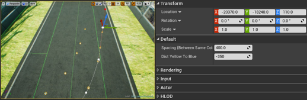
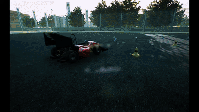
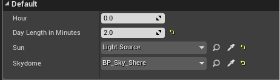

# Graphic Features  

We created two graphic features to ease track creation and to make smart augmentation.  

## Track Creation Tool  

We built a track creation tool in order to build tracks in a more simple, easy and fast
way. The tool helps to build a track for the Formula Student Driverless competitions. The tool is made with a blueprint of a spline.  
By only clicking on a point on the road, we can edit the track as follows:  
The spline points set the right line of the track (yellow cones). The tool builds automatically parallel left line (blue cones) in a constant distance. Moreover, the tool places automatically each cone in each line in a constant distance from the previous one. The constant distances can be change even after placing the track.  
Notice: in order to make a curve you need to add a new point on the spline (right click and choose "duplicate spline point").  
Printing the cone's position to the screen or to a log is optional, by checking it in the "print" nodes in the blueprint editor.  
More information on splines can be found in [UE documentation](https://docs.unrealengine.com/en-us/Engine/BlueprintSplines).  

You can find the spline under Content\RaceCourse\Model\Splines. Also in this folder, there is a tire spline which creates one row of tires.  

  
*spacing determine the distance between cones with the same color, Dist yellow to blue determine the width of the track*

## CycleLight  

Animation of a day light cycle in a changeable, potentially very short period of time.  

  

This feature is built using a blueprint. in order to use it in your environment, you need to attach the CycleLight to your light source and sky sphere.  
To do so, select your light source and sky in the right place in the details section, as shown in the image below.  
This method can help in recording the training data for imitation learning.  

  
*sun- choose you light source. skydome- choose your sky sphere. day length in minutes- decide how long one cycle of the sun will take.* 

The CycleLight is built according to this [tutorial](https://www.youtube.com/watch?v=r94AEtPc9zQ).  
