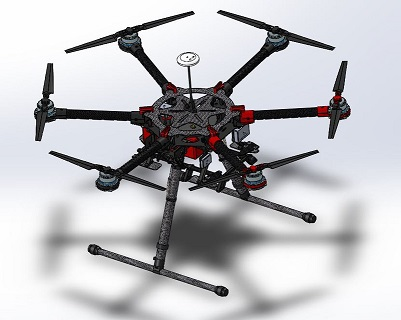
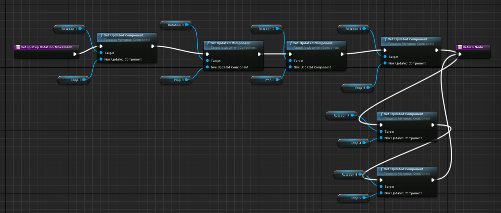
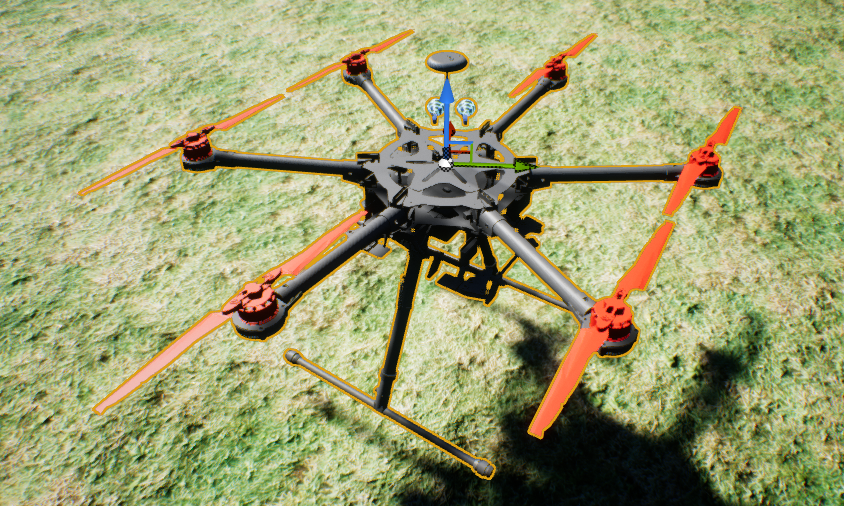

# Building a Hexacopter

So can AirSim fly a hexacopter?  Short answer is yes, but some work is involved to set this up.
It boils down to 3 components need updating, first the PX4 firmware, then the AirSim Physics
and lastly a rendering model.

# PX4 modifications

PX4 needs to be in `hexacopter mode` so it generates output for all 6 motors. But if you are familiar with the QGroundControl "HIL Quadrocopter" AirFrame, 
you will notice there is no `HIL Hexacopter`.  Now according to the PX4 team, we shouldn't need to use special Airframes to get PX4 behaving correctly in 
HIL mode, but alas, today we do.  There are PX4 bugs that stop HIL mode from working properly on any random Airframe.  So short of fixing those bugs, here's
the quick way to get a HIL Hexacopter airframe option.  First clone the git repo as descibed in [px4](px4.md]), then do this:

1. cd ROMFS/px4fmu_common/init.d
2. cp 1001_rc_quad_x.hil 1004_rc_hex_x.hil
3. gedit 1004_rc_hex_x.hil 

and make it contain this:
````
#!nsh
#
# @name HIL Quadcopter +
#
# @type Simulation
#
# @maintainer Anton Babushkin <anton@px4.io>
#

sh /etc/init.d/rc.mc_defaults

set MIXER hexa_x

# Need to set all 8 channels
set PWM_OUT 12345678

set HIL yes
````

Save this file, then do a clean rebuild of px4 using `make px4fmu-v2_default`.  If you did a build already delete the previous build output
`build_px4fmu-v2_default` to be sure your new build picks up this new ROMFS file.  

Now find the QGroundControl configuration file named `PX4AirframeFactMetaData.xml`, on windows this lives in 
`%APPDATA%\QGroundControl.org\PX4AirframeFactMetaData.xml`.  Find airframe id="1001", and copy past that whole airframe XML element and replace it with this:
````
    <airframe id="1004" maintainer="Anton Babushkin &lt;anton@px4.io&gt;" name="HIL Hexacopter X">
      <maintainer>Anton Babushkin &lt;anton@px4.io&gt;</maintainer>
      <type>Simulation</type>
    </airframe>
````
Feel free to set the maintainer to whoever.  So now when your Pixhawk reboots, QGroundControl should show a `HIL Hexacopter X` option under
the "HIL" airframe type, select it and apply it to the PX4, after it reboots it is now ready to fly as a Hexacopter in HIL mode.

# Physics

The physics is easy, all you need to do is specify this "Model" in your [settings json file](settings.md):
```
"Model": "Hexacopter",
```

But what does this do?  Internally this causes Px4MultiRotor.hpp to call setupFrameGenericHex() which calls initializeRotorHexX and that method does
the following as per the [recommended motor arrangement](http://ardupilot.org/copter/docs/connect-escs-and-motors.html).

````
static void initializeRotorHexX(vector<RotorPose>& rotor_poses /* the result we are building */,
    uint rotor_count /* must be 6 */,
    real_T arm_lengths[],
    real_T rotor_z /* z relative to center of gravity */)
{
    Vector3r unit_z(0, 0, -1);  //NED frame
    if (rotor_count == 6) {
        rotor_poses.clear();
        /* Note: rotor_poses are built in this order: rotor 0 is CW

            x-axis
          (2)    (4)
            \  /
             \/
        (1)-------(0) y-axis
             /\
            /  \
          (5)  (3)

        */

        // vectors below are rotated according to NED left hand rule (so the vectors are rotated counter clockwise).
        Quaternionr quadx_rot(AngleAxisr(M_PIf / 6, unit_z));
        Quaternionr no_rot(AngleAxisr(0, unit_z));
        rotor_poses.emplace_back(Vector3r(0, arm_lengths[0], rotor_z),
            unit_z, RotorTurningDirection::RotorTurningDirectionCW);
        rotor_poses.emplace_back(Vector3r(0, -arm_lengths[1], rotor_z),
            unit_z, RotorTurningDirection::RotorTurningDirectionCCW);
        rotor_poses.emplace_back(VectorMath::rotateVector(Vector3r(arm_lengths[2], 0, rotor_z), quadx_rot, true),
            unit_z, RotorTurningDirection::RotorTurningDirectionCW);
        rotor_poses.emplace_back(VectorMath::rotateVector(Vector3r(-arm_lengths[3], 0, rotor_z), quadx_rot, true),
            unit_z, RotorTurningDirection::RotorTurningDirectionCCW);
        rotor_poses.emplace_back(VectorMath::rotateVector(Vector3r(0, arm_lengths[4], rotor_z), quadx_rot, true),
            unit_z, RotorTurningDirection::RotorTurningDirectionCCW);
        rotor_poses.emplace_back(VectorMath::rotateVector(Vector3r(0, -arm_lengths[5], rotor_z), quadx_rot, true),
            unit_z, RotorTurningDirection::RotorTurningDirectionCW);
    }
    else
        throw std::invalid_argument("Rotor count other than 6 is not supported by this method!");
}
````

Now the Vector3r parameters above may need some explanation.  The first motor labelled (0) above is on the y-axis, so it's
vector is obvious `Vector3r(0, arm_lengths[0], rotor_z)` showing 0 on the x-axis and the arm length on the y-axis.  
The second motor labelled (1) is also obvious.  But what about motor (2). 
`
VectorMath::rotateVector(Vector3r(arm_lengths[2], 0, rotor_z), quadx_rot, true)
`
This has x-axis set to armlength and y-axis set to zero, which means it starts out pointing straight up in the above picture.
Then we apply a rotation of pi/6.  But the rotation is using the left handed rotation rule
on a NED coordinate system where z is down, so hold your left hand out, with thumb pointing down, bend your fingers, this is the direction of rotation,
namely, counter clockwise.  So the arm pointing up, rotates into the position shown for motor (2).  Same for the other arms
and now our physics is correctly setup for flying hexacopter.  Of course you can also increase the mass, and tweak the motor thrust parameters if needed.

# Rendering

Lastly, for rendering we need a nice 3d model for a hexacopter.  Udeshaya Wadhwa built a [lovely model of a DJI S900](https://grabcad.com/library/dji-s900-hex-rotor-drone-1).  



So I took this model, and separated the motors (so we could spin them)
and these are [available here](images/DJI S900.zip).  You can 
[import these meshes into Unreal](https://docs.unrealengine.com/latest/INT/Engine/Content/Types/StaticMeshes/HowTo/Importing/index.html).
I found for the Modular Neighborhood world I had to rotate x by 90 and scale down the model to about 20% of original size, changing the
default material to a nice metallic gray, adding the separate spinnable motors as per the the Quadrocopter blueprint.  

What I did was copy and past the BP_FlyingPawn, calling it BP_FlyingHex then added 2 more props and 2 more rotations like this:


Then I edited the SetupPropProtationMovement graph so that it connects the two new props:



One tip there is that you can't copy/paste to get the "Rotation 4" node, you have to drag "Rotation 4" from the Components list and select 'get'
then wire that up to the new Set Updated Cmponent box, and same for Prop 4 and Prop 5.

All you have to do now is fly it!!  And yes, it works :-) 

[](images/Hex.mp4)