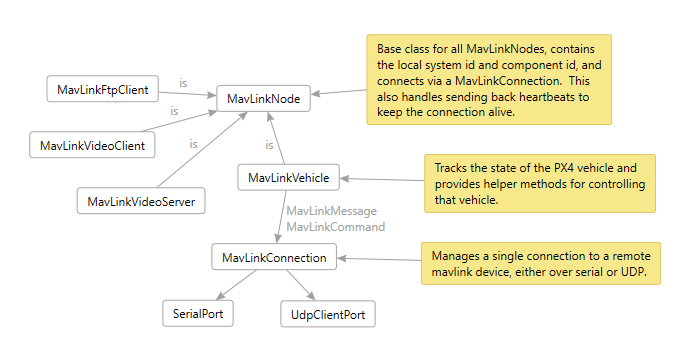
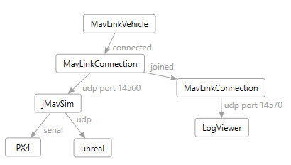
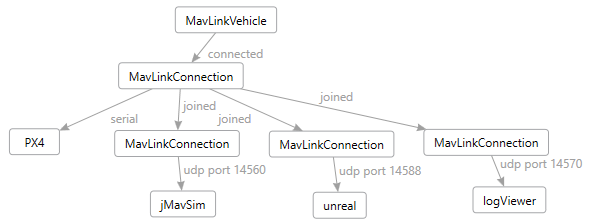

# Welcome to MavLinkCom

MavLinkCom is a cross-platform C++ library that helps connect to and communicate with [MavLink](https://github.com/mavlink/mavlink) based vehicles.
Specifically this library is designed to work well with [PX4](https://github.com/PX4/Firmware) based drones.

## Design

You can view and edit the [Design.dgml](mavlinkcom_design/Design.dgml) diagram in Visual Studio.  

The following are the most important classes in this library.

### MavLinkNode

This is the base class for all MavLinkNodes (subclasses include MavLinkVehicle, MavLinkVideoClient and MavLinkVideoServer).
The node connects to your mavlink enabled vehicle via a MavLinkConnection and provides methods for sending MavLinkMessages and MavLinkCommands
and for subscribing to receive messages.  This base class also stores the local system id and component id your app wants to use to identify
itself to your remove vehicle.  You can also call startHeartbeat to send regular heartbeat messages to keep the connection alive.

### MavLinkMessage

This is the encoded MavLinkMessage.  For those who have used the mavlink.h C API, this is similar to mavlink_message_t.  You do
not create these manually, they are encoded from a strongly typed MavLinkMessageBase subclass.

### Strongly typed message and command classes

The MavLinkComGenerator parses the mavlink common.xml message definitions and generates all the MavLink* MavLinkMessageBase subclasses
as well as a bunch of handy mavlink enums and a bunch of strongly typed MavLinkCommand subclasses.

### MavLinkMessageBase

This is the base class for a set of strongly typed message classes that are code generated by the MavLinkComGenerator project.
This replaces the C messages defined in the mavlink C API and provides a slightly more object oriented way to send and receive messages
via sendMessage on MavLinkNode.  These classes have encode/decode methods that convert to and from the MavLinkMessage class. 

### MavLinkCommand

This is the base class for a set of strongly typed command classes that are code generated by the MavLinkComGenerator project.
This replaces the C definitions defined in the mavlink C API and provides a more object oriented way to send commands via the sendCommand
method on MavLinkNode.  The MavLinkNode takes care of turning these into the underlying mavlink COMMAND_LONG message.

### MavLinkConnection

This class provides static helper methods for creating connections to remote MavLink nodes, over serial ports, as well as UDP, or TCP sockets.
This class provides a way to subscribe to receive messages from that node in a pub/sub way so you can have multiple subscribers on the
same connection.  MavLinkVehicle uses this to track various messages that define the overall vehicle state.

### MavLinkVehicle

MavLinkVehicle is a MavLinkNode that tracks various messages that define the overall vehicle state and provides a VehicleState struct
containing a snapshot of that state, including home position, current orientation, local position, global position, and so on.
This class also provides a bunch of helper methods that wrap commonly used commands providing simple method calls to do things like
arm, disarm, takeoff, land, go to a local coordinate, and fly under offbaord control either by position or velocity control.

### MavLinkTcpServer

This helper class provides a way to setup a "server" that accepts MavLinkConnections from remote nodes.  You can use this class
to get a connection that you can then give to MavLinkVideoServer to serve images over MavLink.

### MavLinkFtpClient

This helper class takes a given MavLinkConnection and provides FTP client support for the MAVLINK_MSG_ID_FILE_TRANSFER_PROTOCOL
for vehicles that support the FTP capability.  This class provides simple methods to list directory contents, and the get and put
files.

### MavLinkVideoClient

This helper class takes a given MavLinkConnection and provides helper methods for requesting video from remote node and 
packaging up the MAVLINK_MSG_ID_DATA_TRANSMISSION_HANDSHAKE and MAVLINK_MSG_ID_ENCAPSULATED_DATA messages into simple to use
MavLinkVideoFrames.

### MavLinkVideoServer

This helper class takes a given MavLinkConnection and provides the server side of the MavLinkVideoClient protocol, including helper methods 
for notifying when there is a video request to process (hasVideoRequest) and a method to send video frames (sendFrame) which 
will generate the right MAVLINK_MSG_ID_DATA_TRANSMISSION_HANDSHAKE and MAVLINK_MSG_ID_ENCAPSULATED_DATA sequence.

## Examples

The following code from the UnitTest project shows how to connect to a [Pixhawk](http://www.pixhawk.org/) flight controller over USB serial port, 
then wait for the first heartbeat message to be received:

    auto connection = MavLinkConnection::connectSerial("drone", "/dev/ttyACM0", 115200, "sh /etc/init.d/rc.usb\n");
	MavLinkHeartbeat heartbeat;
	if (!waitForHeartbeat(10000, heartbeat)) {
		throw std::runtime_error("Received no heartbeat from PX4 after 10 seconds");
	}

	
The following code connects to serial port, and then forwards all messages to and from QGroundControl to that drone using another connection
that is joined to the drone stream.

    auto droneConnection = MavLinkConnection::connectSerial("drone", "/dev/ttyACM0", 115200, "sh /etc/init.d/rc.usb\n");
	auto proxyConnection = MavLinkConnection::connectRemoteUdp("qgc", "127.0.0.1", "127.0.0.1", 14550);
	droneConnection->join(proxyConnection);

The following code then takes that connection and turns on heartBeats and starts tracking vehicle information using local
system id 166 and component id 1.

	auto vehicle = std::make_shared<MavLinkVehicle>(166, 1);
	vehicle->connect(connection);
	vehicle->startHeartbeat();

	std::this_thread::sleep_for(std::chrono::seconds(5));
	
	VehicleState state = vehicle->getVehicleState();
	printf("Home position is %s, %f,%f,%f\n", state.home.is_set ? "set" : "not set", 
		state.home.global_pos.lat, state.home.global_pos.lon, state.home.global_pos.alt);

The following code uses the vehicle object to arm the drone and take off and wait for the takeoff altitude to be reached:

	bool rc = false;
	if (!vehicle->armDisarm(true).wait(3000, &rc) || !rc) {
		printf("arm command failed\n");
		return;
	}
	if (!vehicle->takeoff(targetAlt).wait(3000, &rc) || !rc) {
		printf("takeoff command failed\n");
		return;
	}
	int version = vehicle->getVehicleStateVersion();
	while (true) {
		int newVersion = vehicle->getVehicleStateVersion();
		if (version != newVersion) {
			VehicleState state = vehicle->getVehicleState();
			float alt = state.local_est.pos.z;
			if (alt >= targetAlt - delta && alt <= targetAlt + delta)
			{			
				reached = true;
				printf("Target altitude reached\n");
				break;
			}
		} else {
			std::this_thread::sleep_for(std::chrono::milliseconds(10));
		}
	}
	
The following code uses offboard control to make the drone fly in a circle with camera pointed at the center.
Here we use the subscribe method to check each new local position message to indicate so we can compute the new 
velocity vector as soon as that new position is received.  We request a high rate for those messages using 
setMessageInterval to ensure smooth circular orbit.
	
	vehicle->setMessageInterval((int)MavLinkMessageIds::MAVLINK_MSG_ID_LOCAL_POSITION_NED, 30);
	vehicle->requestControl();
	int subscription = vehicle->getConnection()->subscribe(
		[&](std::shared_ptr<MavLinkConnection> connection, const MavLinkMessage& m) {
			if (m.msgid == (int)MavLinkMessageIds::MAVLINK_MSG_ID_LOCAL_POSITION_NED)
			{
				float x = localPos.x;
				float y = localPos.y;
				float dx = x - cx;
				float dy = y - cy;
				float angle = atan2(dy, dx);
				if (angle < 0) angle += M_PI * 2;
				float tangent = angle + M_PI_2;
				double newvx = orbitSpeed * cos(tangent);
				double newvy = orbitSpeed * sin(tangent);
				float heading = angle + M_PI;
				vehicle->moveByLocalVelocityWithAltHold(newvx, newvy, altitude, true, heading);
			}
		});

The following code stops flying the drone in offboard mode and tells the drone to loiter at its current location.
This version of the code shows how to use the AsyncResult without blocking on a wait call.

	vehicle->releaseControl();
	if (vehicle->loiter().then([=](bool rc) {
		printf("loiter command %s\n", rc ? "succeeded" : "failed");
	}
	
The following code gets all configurable parameters from the drone and prints them:

    auto list = vehicle->getParamList();
	auto end = list.end();
	int count = 0;
	for (auto iter = list.begin(); iter < end; iter++)
	{
		count++;
		MavLinkParameter p = *iter;
		if (p.type == MAV_PARAM_TYPE_REAL32 || p.type == MAV_PARAM_TYPE_REAL64) {
			printf("%s=%f\n", p.name.c_str(), p.value);
		}
		else {
			printf("%s=%d\n", p.name.c_str(), static_cast<int>(p.value));
		}
	}

The following code sets a parameter on the Pixhawk to disable the USB safety check (this is handy if you are controlling
the Pixhawk over USB using another onboard computer that is part of the drone itself).  You should NOT do this if you
are connecting your PC or laptop to the drone over USB.

    MavLinkParameter  p;
    p.name = "CBRK_USB_CHK";
    p.value = 197848;
    if (!vehicle->setParameter(p).wait(3000,&rc) || !rc) {
		printf("Setting the CBRK_USB_CHK failed");
	}

MavLinkVehicle actually has a helper method for this called allowFlightControlOverUsb, so now you know how it is implemented :-) 

## Advanced Connections

You can wire up different configurations of mavlink pipelines using the MavLinkConnection class "join" method as shown below.

Example 1, we connect to PX4 over serial, and proxy those messages through to QGroundControl and the LogViewer who are listening on remote ports.  

Example 2: simulation can talk to jMavSim and jMavSim connects to PX4.  jMavSim can also manage multiple connections, so it can talk to unreal simulator. 
Another MavLinkConnection can be joined to proxy connections that jMavSim doesn't support, like the LogViewer or a remote camera node.

Example 3: we use MavLinkConnection to connect to PX4 over serial, then join additional connections for all our remote nodes including jMavSim.

Example 4: We can also do distributed systems to control the drone remotely:

