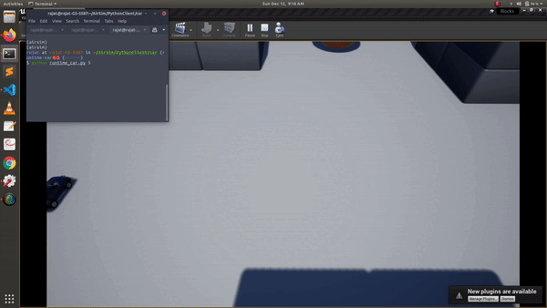

# Multiple Vehicles in AirSim

Since release 1.2, AirSim is fully enabled for multiple vehicles. This capability allows you to create multiple vehicles easily and use APIs to control them.

## Creating Multiple Vehicles

It's as easy as specifying them in [settings.json](settings.md). The `Vehicles` element allows you to specify list of vehicles you want to create along with their initial positions and orientations. The positions are specified in NED coordinates in SI units with origin set at Player Start component in Unreal environment. The orientation is specified as Yaw, Pitch and Roll in degrees.

### Creating Multiple Cars

```json
{
	"SettingsVersion": 1.2,
	"SimMode": "Car",

	"Vehicles": {
		"Car1": {
		  "VehicleType": "PhysXCar",
		  "X": 4, "Y": 0, "Z": -2
		},
		"Car2": {
		  "VehicleType": "PhysXCar",
		  "X": -4, "Y": 0, "Z": -2,
      "Yaw": 90
		}
  }
}
```

### Creating Multiple Drones

```json
{
	"SettingsVersion": 1.2,
	"SimMode": "Multirotor",

	"Vehicles": {
		"Drone1": {
		  "VehicleType": "SimpleFlight",
		  "X": 4, "Y": 0, "Z": -2,
      "Yaw": -180
		},
		"Drone2": {
		  "VehicleType": "SimpleFlight",
		  "X": 8, "Y": 0, "Z": -2
		}

    }
}
```

## Using APIs for Multiple Vehicles

The new APIs since AirSim 1.2 allows you to specify `vehicle_name`. This name corresponds to keys in json settings (for example, Car1 or Drone2 above).

[Example code for cars](https://github.com/microsoft/AirSim/blob/main/PythonClient/car/multi_agent_car.py)

[Example code for multirotors](https://github.com/microsoft/AirSim/blob/main/PythonClient/multirotor/multi_agent_drone.py)

Using APIs for multi-vehicles requires specifying the `vehicle_name`, which needs to be hardcoded in the script or requires parsing of the settings file. There's also a simple API `listVehicles()` which returns a list (vector in C++) of strings containing names of the current vehicles. For example, with the above settings for 2 Cars -

```python
>>> client.listVehicles()
['Car1', 'Car2']
```

### Demo

[](https://youtu.be/35dgcuLuF5M)

### Creating vehicles at runtime through API

In the latest main branch of AirSim, the `simAddVehicle` API can be used to create vehicles at runtime. This is useful to create many such vehicles without needing to specify them in the settings. There are some limitations of this currently, described below -

`simAddVehicle` takes in the following arguments:

- `vehicle_name`: Name of the vehicle to be created, this should be unique for each vehicle including any exisiting ones defined in the settings.json
- `vehicle_type`: Type of vehicle, e.g. "simpleflight". Currently only SimpleFlight, PhysXCar, ComputerVision are supported, in their respective SimModes.
                  Other vehicle types including PX4 and ArduPilot-related aren't supported
- `pose`: Initial pose of the vehicle
- `pawn_path`: Vehicle blueprint path, default empty wbich uses the default blueprint for the vehicle type

Returns: `bool` Whether vehicle was created

The usual APIs can be used to control and interact with the vehicle once created, with the `vehicle_name` parameter. Specifying other settings such as additional cameras, etc. isn't possible currently, a future enhancement could be passing JSON string of settings for the vehicle. It also works with the `listVehicles()` API described above, so the vehicles spawned would be included in the list.

For some examples, check out [HelloSpawnedDrones.cpp](https://github.com/microsoft/AirSim/blob/main/HelloSpawnedDrones/HelloSpawnedDrones.cpp) -


And [runtime_car.py](https://github.com/microsoft/AirSim/tree/main/PythonClient/car/runtime_car.py) -


