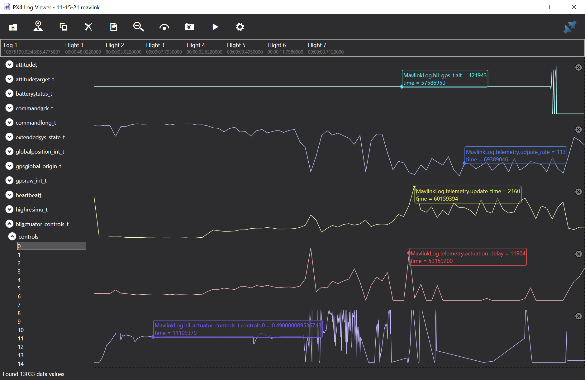
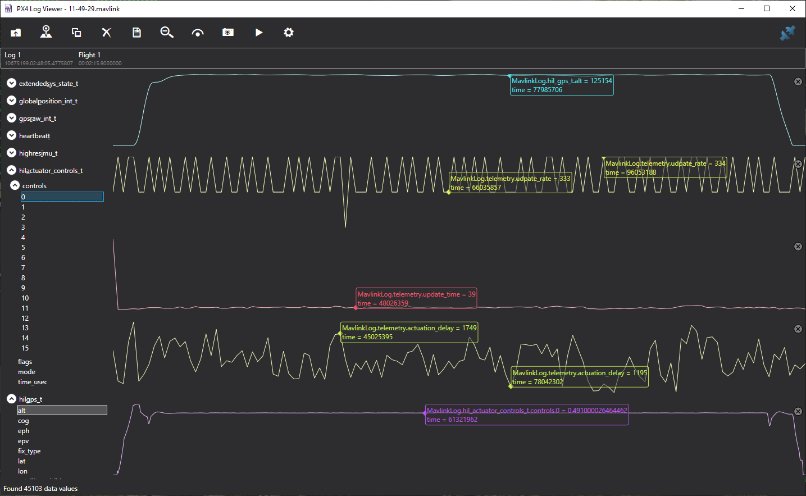

# PX4/MavLink Logging

Thanks to [Chris Lovett](https://github.com/clovett) for developing various tools for PX4/MavLink logging mentioned on this page!

## Logging MavLink Messages

AirSim can capture mavlink log files if you add the following to the PX4 section of your `settings.json` file:

```json
{
    "SettingsVersion": 1.2,
    "SimMode": "Multirotor",
    "Vehicles": {
        "PX4": {
            ...,
            "Logs": "c:/temp/mavlink"
        }
    }
}
```

AirSim will create a timestamped log file in this folder for each "armed/disarmed" flight session.

You will then see log files organized by date in d:\temp\logs, specifically *input.mavlink and *output.mavlink files.

## MavLink LogViewer
For MavLink enabled drones, you can also use our [Log Viewer](log_viewer.md) to visualize the streams of data.
If you enable this form of realtime logging you should not use the "Logs" setting above, these two forms of logging
are mutually exclusive.

## PX4 Log in SITL Mode

In SITL mode, please a log file is produced when drone is armed. The SITL terminal will contain the path to the log file, it should look something like this
```
INFO  [logger] Opened log file: rootfs/fs/microsd/log/2017-03-27/20_02_49.ulg
```

## PX4 Log in HITL Mode

If you are using Pixhawk hardware in HIL mode, then set parameter `SYS_LOGGER=1`
using QGroundControl. PX4 will write log file on device which you can download at later date using QGroundControl.

## Debugging a bad flight

You can use these *.mavlink log files to debug a bad flight using the [LogViewer](log_viewer.md).
For example, AirSim/PX4 flight may misbehave if you run it on an under powered computer.
The following shows what might happen in that situation.



In this flight we ran a simple `commander takeoff` test as performed
by `PythonClient/multirotor/stability_test.py` and the flight started off fine, but then went crazy at the end and the drone crashed.  So why is that?  What can the log file show?

Here we've plotted the following 5 metrics:
- `hil_gps.alt` - the simulated altitude sent from AirSim to PX4
- `telemetry.update_rate` - the rate AirSim is performing the critical drone update loop in updates per second.
- `telemetry.update_time` - the average time taken inside AirSim performing the critical drone update loop.
- `telemetry.actuation_delay` - this is a very interesting metric measuring how long it takes PX4 to send back updated actuator controls message (motor power)
- `actuator_controls.0` - the actuator controls signal from PX4 for the first rotor.

What we see then with these metrics is that things started off nicely, with nice flat altitude, high update rate in the 275 to 300 fps range, and a nice low update time inside AirSim around 113 microseconds, and a nice low actuation delay in the round trip from PX4.  The actuator controls also stabilize quickly to a nice flat line.

But then the update_time starts to climb, at the same time the actuation_delay climbs and we see a little tip in actuator_controls.
This dip should not happen, the PX4 is panicking over loss of update rate but it recovers.

But then we see actuator controls go crazy, a huge spike in actuation delay, and around this time we see a message from AirSim saying `lockstep disabled`.  A delay over 100 millisecond triggers AirSim into jumping out of lockstep mode and the PX4 goes nuts and the drone crashes.

The button line is that if a simple `takeoff` cannot maintain steady smooth flight and you see these kinds of spikes and uneven update rates
then it means you are running AirSim on a computer that does not have enough horsepower.

This is what a simple takeoff and hover and land should look like:



Here you see the `update_rate` sticking the target of 333 updates per second.
You also see the `update_time` a nice flat 39 microseconds and the `actuator_delay`
somewhere between 1.1 and 1.7 milliseconds, and the resulting `actuator_controls`
a lovely flat line.


