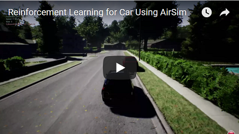
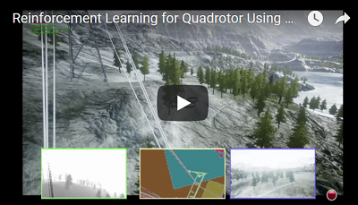

# Reinforcement Learning in AirSim

We below describe how we can implement DQN in AirSim using CNTK. The easiest way is to first install python only CNTK ([instructions](https://docs.microsoft.com/en-us/cognitive-toolkit/setup-windows-python?tabs=cntkpy22)).

CNTK provides several demo examples of [deep RL](https://github.com/Microsoft/CNTK/tree/master/Examples/ReinforcementLearning). We will modify the DeepQNeuralNetwork.py to work with AirSim. We can utilize most of the classes and methods corresponding to the DQN algorithm. However, there are certain additions we need to make for AirSim.

#### Disclaimer
This is still in active development. What we share below is a framework that can be extended and tweaked to obtain better performance.

## RL with Car

[Source code](https://github.com/Microsoft/AirSim/blob/master/PythonClient/DQNcar.py)

This example works with AirSimNeighborhood environment available in [releases](https://github.com/Microsoft/AirSim/releases).

First, we need to get the images from simulation and transform it appropriately. Below, we show how a depth image can be obtained from the ego camera and transformed to a 84X84 input to the network. (you can use other sensor modalities, and sensor inputs as well – of course you’ll have to modify the code accordingly).

```
responses = client.simGetImages([ImageRequest(0, AirSimImageType.DepthPerspective, True, False)])
current_state = transform_input(responses)
```

We further define the six actions (breaking, straight with throttle, full-left with throttle, full-right with throttle, half-left with throttle, half-right with throttle) that an agent can execute. This is done via the function `interpret_action`:

```
def interpret_action(action):
    car_controls.brake = 0
    car_controls.throttle = 1
    if action == 0:
        car_controls.throttle = 0
        car_controls.brake = 1
    elif action == 1:
        car_controls.steering = 0
    elif action == 2:
        car_controls.steering = 0.5
    elif action == 3:
        car_controls.steering = -0.5
    elif action == 4:
        car_controls.steering = 0.25
    else:
        car_controls.steering = -0.25
    return car_controls
```

We then define the reward function in `compute_reward` as a convex combination of how fast the vehicle is travelling and how much it deviates from the center line. The agent gets a high reward when its moving fast and staying in the center of the lane.

```
def compute_reward(car_state):
    MAX_SPEED = 300
    MIN_SPEED = 10
    thresh_dist = 3.5
    beta = 3

    z = 0
    pts = [np.array([0, -1, z]), np.array([130, -1, z]), np.array([130, 125, z]), np.array([0, 125, z]), np.array([0, -1, z]), np.array([130, -1, z]), np.array([130, -128, z]), np.array([0, -128, z]), np.array([0, -1, z])]
    pd = car_state.position
    car_pt = np.array(list(pd.values()))

    dist = 10000000
    for i in range(0, len(pts)-1):
        dist = min(dist, np.linalg.norm(np.cross((car_pt - pts[i]), (car_pt - pts[i+1])))/np.linalg.norm(pts[i]-pts[i+1]))

    #print(dist)
    if dist > thresh_dist:
        reward = -3
    else:
        reward_dist = (math.exp(-beta*dist) - 0.5)
        reward_speed = (((car_state.speed - MIN_SPEED)/(MAX_SPEED - MIN_SPEED)) - 0.5)
        reward = reward_dist + reward_speed

    return reward
```

The function `isDone` determines if the episode has terminated (e.g. due to collision). We look at the speed of the vehicle and if it is less than a threshold than the episode is considered to be terminated.

```
def isDone(car_state, car_controls, reward):
    done = 0
    if reward < -1:
        done = 1
    if car_controls.brake == 0:
        if car_state.speed <= 5:
            done = 1
    return done
```

The main loop then sequences through obtaining the image, computing the action to take according to the current policy, getting a reward and so forth.
If the episode terminates then we reset the vehicle to the original state via: 

```
client.reset()
car_control = interpret_action(1) // Reset position and drive straight for one second
client.setCarControls(car_control)
time.sleep(1)
```

Note that the simulation needs to be up and running before you execute DQNcar.py. The video below shows first few episodes of DQN training.

[](https://youtu.be/fv-oFPAqSZ4)

## RL with Quadrotor

[Source code](https://github.com/Microsoft/AirSim/blob/master/PythonClient/DQNdrone.py)

This example works with AirSimMountainLandscape environment available in [releases](https://github.com/Microsoft/AirSim/releases).

We can similarly apply RL for various autonomous flight scenarios with quadrotors. Below is an example on how RL could be used to train quadrotors to follow high tension powerlines (e.g. application for energy infrastructure inspection).
There are seven actions here that correspond to different directions in which the quadrotor can move in (six directions + one hovering action).

```
def interpret_action(action):
    if action == 0:
        quad_offset = (0, 0, 0)
    elif action == 1:
        quad_offset = (1, 0, 0)
    elif action == 2:
        quad_offset = (0, 1, 0)
    elif action == 3:
        quad_offset = (0, 0, 1)
    elif action == 4:
        quad_offset = (-1, 0, 0)    
    elif action == 5:
        quad_offset = (0, -1, 0)
    elif action == 6:
        quad_offset = (0, 0, -1)
    return quad_offset
```

The reward again is a function how how fast the quad travels in conjunction with how far it gets from the known powerlines.

```
def compute_reward(quad_state, quad_vel, collision_info):
    thresh_dist = 10
    beta = 1

    z = -10
    pts = [np.array([0, 0, z]), np.array([130, 0, z]), np.array([130, 125, z]), np.array([0, 125, z]), np.array([0, 0, z]), np.array([130, 0, z]), np.array([130, -128, z]), np.array([0, -128, z]), np.array([0, 0, z])]
    quad_pt = np.array(list((quad_state.x_val, quad_state.y_val, quad_state.z_val)))

    if collision_info.has_collided:
        reward = -100
    else:    
        dist = 10000000
        for i in range(0, len(pts)-1):
            dist = min(dist, np.linalg.norm(np.cross((quad_pt - pts[i]), (quad_pt - pts[i+1])))/np.linalg.norm(pts[i]-pts[i+1]))

        if dist > thresh_dist:
            reward = -10
        else:
            reward = 2*(0.5 - math.exp(-beta*dist)) + np.linalg.norm([quad_vel.x_val, quad_vel.y_val, quad_vel.z_val])

    return reward
```

We consider an episode to terminate if it drifts too much away from the known powerline coordinates. 

The reset function here flies the quadrotor to the initial starting point:

```
    if done:
        client.moveToZ(clearZ, 2)
        client.moveToPosition(initX, initY, clearZ, 2)
        client.moveToPosition(initZ, initY, initZ, 2)
        current_step +=1
```

Here is the video of first few episodes during the training.

[](https://youtu.be/uKm15Y3M1Nk)
