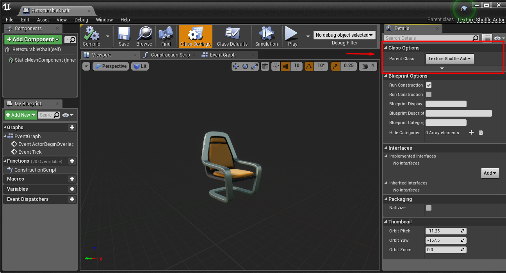
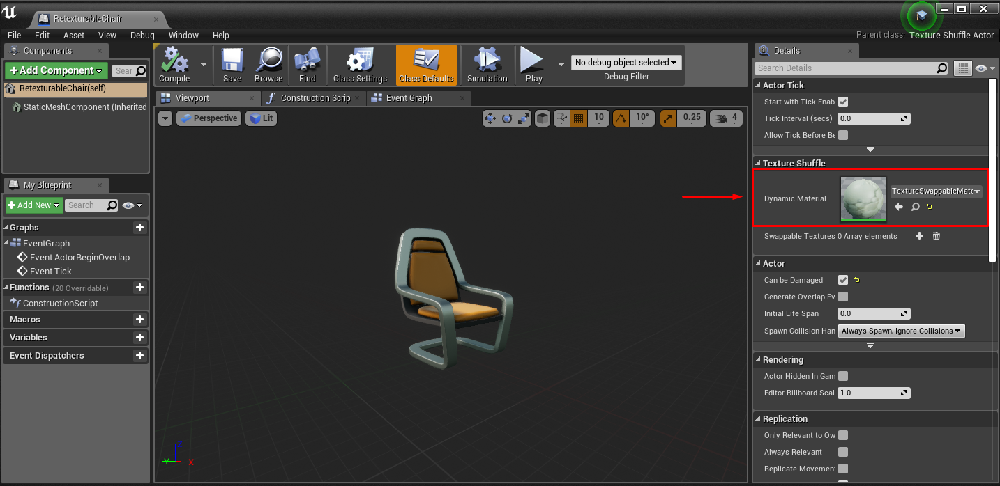

# Runtime Texture Swapping

## How to Make An Actor Retexturable

To be made texture-swappable, an actor must derive from the parent class TextureShuffleActor.
The parent class can be set via the settings tab in the actor's blueprint.



After setting the parent class to TextureShuffActor, the object gains the member DynamicMaterial.
DynamicMaterial needs to be set--on all actor instances in the scene--to TextureSwappableMaterial.
Warning: Statically setting the Dynamic Material in the blueprint class may cause rendering errors. It seems to work better to set it on all the actor instances in the scene, using the details panel.



## How to Define the Set(s) of Textures to Choose From

Typically, certain subsets of actors will share a set of texture options with each other. (e.g. walls that are part of the same building)

It's easy to set up these groupings by using Unreal Engine's group editing functionality.
Select all the instances that should have the same texture selection, and add the textures to all of them simultaneously via the Details panel.
Use the same technique to add descriptive tags to groups of actors, which will be used to address them in the API.


It's ideal to work from larger groupings to smaller groupings, simply deselecting actors to narrow down the grouping as you go, and applying any individual actor properties last.


## How to Swap Textures from the API

The following API is available in C++ and python. (C++ shown)

```C++
std::vector<std::string> simSwapTextures(const std::string& tags, int tex_id);
```

The string of "," or ", " delimited tags identifies on which actors to perform the swap.
The tex_id indexes the array of textures assigned to each actor undergoing a swap.
The function will return the list of objects which matched the provided tags and had the texture swap perfomed.
If tex_id is out-of-bounds for some object's texture set, it will be taken modulo the number of textures that were available.

Demo (Python):

```Python
import airsim
import time

c = airsim.client.MultirotorClient()
print(c.simSwapTextures("furniture", 0))
time.sleep(2)
print(c.simSwapTextures("chair", 1))
time.sleep(2)
print(c.simSwapTextures("table", 1))
time.sleep(2)
print(c.simSwapTextures("chair, right", 0))
```

Results:

```bash
['RetexturableChair', 'RetexturableChair2', 'RetexturableTable']
['RetexturableChair', 'RetexturableChair2']
['RetexturableTable']
['RetexturableChair2']
```


Note that in this example, different textures were chosen on each actor for the same index value.

You can also use the `simSetObjectMaterial` and `simSetObjectMaterialFromTexture` APIs to set an object's material to any material asset or filepath of a texture. For more information on using these APIs, see [Texture APIs](apis.md#texture-apis).
