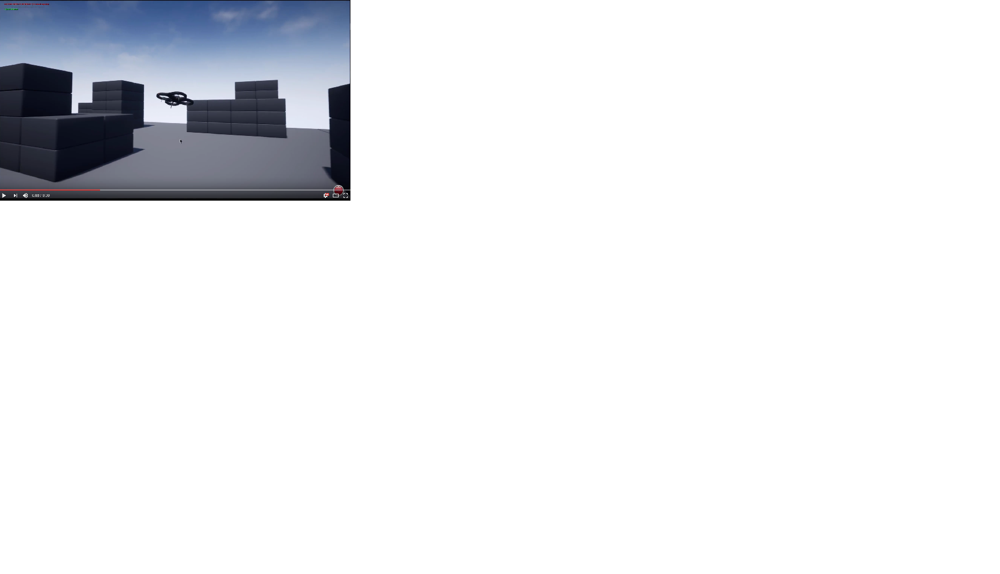

# Setup Blocks Environment for AirSim

Blocks environment is available in repo in folder `Unreal/Environments/Blocks` and is designed to be lightweight in size. That means its very basic but fast.

Here are quick steps to get Blocks environment up and running:

## Windows

1. Make sure you have [installed Unreal and built AirSim](build_windows.md).
2. Navigate to folder `AirSim\Unreal\Environments\Blocks`, double click on Blocks.sln file to open in Visual Studio. By default, this project is configured for Visual Studio 2019. However, if you want to generate this project for Visual Studio 2022, go to 'Edit->Editor Preferences->Source Code' inside the Unreal Editor and select 'Visual Studio 2022' for the 'Source Code Editor' setting.
3. Make sure `Blocks` project is the startup project, build configuration is set to `DebugGame_Editor` and `Win64`. Hit F5 to run.
4. Press the Play button in Unreal Editor and you will see something like in below video. Also see [how to use AirSim](https://github.com/Microsoft/AirSim/#how-to-use-it).

### Changing Code and Rebuilding
For Windows, you can just change the code in Visual Studio, press F5 and re-run. There are few batch files available in folder `AirSim\Unreal\Environments\Blocks` that lets you sync code, clean etc.

## Linux
1. Make sure you have [built the Unreal Engine and AirSim](build_linux.md).
2. Navigate to your UnrealEngine repo folder and run `Engine/Binaries/Linux/UE4Editor` which will start Unreal Editor.
3. On first start you might not see any projects in UE4 editor. Click on Projects tab, Browse button and then navigate to `AirSim/Unreal/Environments/Blocks/Blocks.uproject`. 
4. If you get prompted for incompatible version and conversion, select In-place conversion which is usually under "More" options. If you get prompted for missing modules, make sure to select No so you don't exit. 
5. Finally, when prompted with building AirSim, select Yes. Now it might take a while so go get some coffee :).
6. Press the Play button in Unreal Editor and you will see something like in below video. Also see [how to use AirSim](https://github.com/microsoft/AirSim/#how-to-use-it).

### Changing Code and Rebuilding
For Linux, make code changes in AirLib or Unreal/Plugins folder and then run `./build.sh` to rebuild. This step also copies the build output to Blocks sample project. You can then follow above steps again to re-run.

## Chosing Your Vehicle: Car or Multirotor
By default AirSim spawns multirotor. You can easily change this to car and use all of AirSim goodies. Please see [using car](using_car.md) guide.

## FAQ
#### I see warnings about like "_BuitData" file is missing. 
These are intermediate files and you can safely ignore it.
