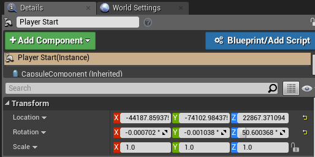
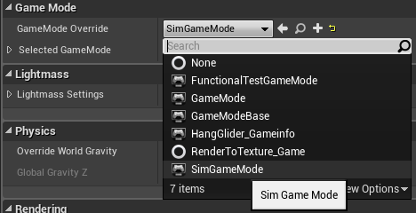

# Creating and Setting Up Unreal Environment
This page contains the complete instructions start to finish for setting up Unreal environment with AirSim. The Unreal Marketplace has [several environment](https://www.unrealengine.com/marketplace/content-cat/assets/environments) available that you can start using in just few minutes. It is also possible to use environments available on websites such as [turbosquid.com](https://www.turbosquid.com/) or [cgitrader.com](https://www.cgtrader.com/) with bit more effort (here's [tutorial video](https://www.youtube.com/watch?v=y09VbdQWvQY&feature)). In addition there also several [free environments](https://github.com/Microsoft/AirSim/issues/424) available.

Below we will use a freely downloadable environment from Unreal Marketplace called Landscape Mountain but the steps are same for any other environments. You can also view these steps performed in [Unreal AirSim Setup Video](https://youtu.be/1oY8Qu5maQQ).

## Note for Linux Users
There is no `Epic Games Launcher` for Linux which means that if you need to create custom environment, you will need Windows machine to do that. Once you have Unreal project folder, just copy it over to your Linux machine.

## Step by Step Instructions

1. Make sure AirSim is built and Unreal 4.24 is installed as described in [build instructions](build_windows.md).
2. In `Epic Games Launcher` click the Learn tab then scroll down and find `Landscape Mountains`. Click the `Create Project` and download this content (~2GB download).

    

3. Open `LandscapeMountains.uproject`, it should launch the Unreal Editor.

    

4. From the `File menu` select `New C++ class`, leave default `None` on the type of class, click `Next`, leave default name `MyClass`, and click `Create Class`. We need to do this because Unreal requires at least one source file in project. It should trigger compile and open up Visual Studio solution `LandscapeMountains.sln`.

5. Go to your folder for AirSim repo and copy `Unreal\Plugins` folder in to your `LandscapeMountains` folder. This way now your own Unreal project has AirSim plugin.

6. Edit the `LandscapeMountains.uproject` so that it looks like this

```json
{
	"FileVersion": 3,
	"EngineAssociation": "4.24",
	"Category": "Samples",
	"Description": "",
	"Modules": [
		{
			"Name": "LandscapeMountains",
			"Type": "Runtime",
			"LoadingPhase": "Default",
			"AdditionalDependencies": [
				"AirSim"
			]
		}
	],
	"TargetPlatforms": [
		"MacNoEditor",
		"WindowsNoEditor"
	],
	"Plugins": [
		{
			"Name": "AirSim",
			"Enabled": true
		}
	]
}
```

7. Close Visual Studio and the  `Unreal Editor` and right click the LandscapeMountains.uproject in Windows Explorer and select `Generate Visual Studio Project Files`.  This step detects all plugins and source files in your Unreal project and generates `.sln` file for Visual Studio.

    

    Tip: If the `Generate Visual Studio Project Files` option is missing you may need to reboot your machine for the Unreal Shell extensions to take effect.  If it is still missing then open the LandscapeMountains.uproject in the Unreal Editor and select `Refresh Visual Studio Project` from the `File` menu.

8. Reopen `LandscapeMountains.sln` in Visual Studio, and make sure "DebugGame Editor" and "Win64" build configuration is the active build configuration.

    

9. Press `F5` to `run`. This will start the Unreal Editor. The Unreal Editor allows you to edit the environment, assets and other game related settings. First thing you want to do in your environment is set up `PlayerStart` object. In Landscape Mountains environment, `PlayerStart` object already exist and you can find it in the `World Outliner`. Make sure its location is setup as shown. This is where AirSim plugin will create and place the vehicle. If its too high up then vehicle will fall down as soon as you press play giving potentially random behavior

    

10. In `Window/World Settings` as shown below, set the `GameMode Override` to `AirSimGameMode`:

    

11. Go to 'Edit->Editor Preferences' in Unreal Editor, in the 'Search' box type 'CPU' and ensure that the 'Use Less CPU when in Background' is unchecked. If you don't do this then UE will be slowed down dramatically when UE window loses focus.

12. Be sure to `Save` these edits. Hit the Play button in the Unreal Editor. See [how to use AirSim](https://github.com/Microsoft/AirSim/#how-to-use-it).

Congratulations! You are now running AirSim in your own Unreal environment.

## Choosing Your Vehicle: Car or Multirotor
By default AirSim prompts user for which vehicle to use. You can easily change this by setting [SimMode](settings.md#SimMode). Please see [using car](using_car.md) guide.

## Updating Your Environment to Latest Version of AirSim
Once you have your environment using above instructions, you should frequently update your local AirSim code to latest version from GitHub. Below are the instructions to do this:

1. First put [clean.bat](https://github.com/Microsoft/AirSim/blob/master/Unreal/Environments/Blocks/clean.bat) (or [clean.sh](https://github.com/Microsoft/AirSim/blob/master/Unreal/Environments/Blocks/clean.sh) for Linux users) in the root folder of your environment. Run this file to clean up all intermediate files in your Unreal project.
2. Do `git pull` in your AirSim repo followed by `build.cmd` (or `./build.sh` for Linux users).
3. Replace [your project]/Plugins folder with AirSim/Unreal/Plugins folder.
4. Right click on your .uproject file and chose "Generate Visual Studio project files" option. This is not required for Linux.

## FAQ

#### What are other cool environments?
[Unreal Marketplace](https://www.unrealengine.com/marketplace) has dozens of prebuilt extra-ordinarily detailed [environments](https://www.unrealengine.com/marketplace/content-cat/assets/environments) ranging from Moon to Mars and everything in between. The one we have used for testing is called [Modular Neighborhood Pack](https://www.unrealengine.com/marketplace/modular-neighborhood-pack)
but you can use any environment. Another free environment is [Infinity Blade series](https://www.unrealengine.com/marketplace/infinity-blade-plain-lands). Alternatively, if you look under the Learn tab in Epic Game Launcher, you will find many free samples that you can use. One of our favorites is "A Boy and His Kite" which is a 100 square miles of highly detailed environment (caution: you will need *very* beefy PC to run it!).

#### When I press Play button some kind of video starts instead of my vehicle.
If the environment comes with MatineeActor, delete it to avoid any startup demo sequences. There might be other ways to remove it as well, for example, click on Blueprints button, then Level Blueprint and then look at Begin Play event in Event Graph. You might want to disconnect any connections that may be starting "matinee".

#### Is there easy way to sync code in my Unreal project with code in AirSim repo?
Sure, there is! You can find bunch of `.bat` files (for linux, `.sh`) in `AirSim\Unreal\Environments\Blocks`. Just copy them over to your own Unreal project. Most of these are quite simple and self explanatory.

#### I get some error about map.
You might have to set default map for your project. For example, if you are using Modular Neighborhood Pack, set the Editor Starter Map as well as Game Default Map to Demo_Map in Project Settings > Maps & Modes.

#### I see "Add to project" option for environment but not "Create project" option.
In this case, create a new blank C++ project with no Starter Content and add your environment in to it.

#### I already have my own Unreal project. How do I use AirSim with it?
Copy the `Unreal\Plugins` folder from the build you did in the above section into the root of your Unreal project's folder. In your Unreal project's .uproject file, add the key `AdditionalDependencies` to the "Modules" object
as we showed in the `LandscapeMountains.uproject` above.
```json
"AdditionalDependencies": [
    "AirSim"
]
```

and the `Plugins` section to the top level object:
```json
"Plugins": [
    {
        "Name": "AirSim",
        "Enabled": true
    }
]
```
