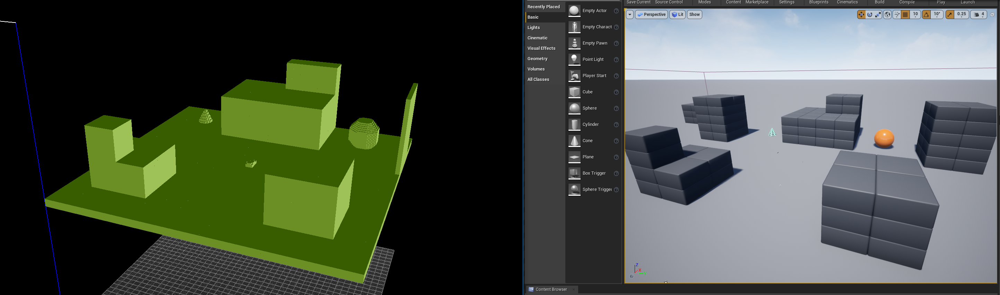
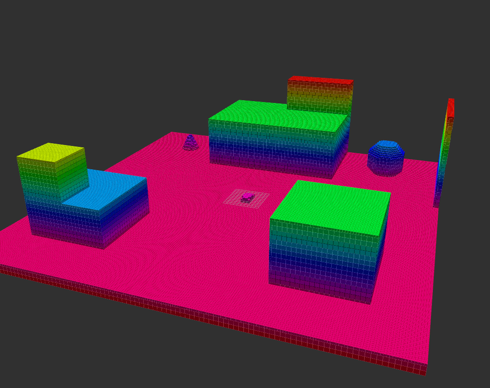

AirSim provides a feature that constructs ground truth voxel grids of the world directly from Unreal Engine. A voxel grid is a representation of the occupancy of a given world/map, by discretizing into cells of a certain size; and recording a voxel if that particular location is occupied. 

The logic for constructing the voxel grid is in WorldSimApi.cpp->createVoxelGrid(). For now, the assumption is that the voxel grid is a cube - and the API call from Python is of the structure:

```
simCreateVoxelGrid(self, position, x, y, z, res, of)

position (Vector3r): Global position around which voxel grid is centered in m
x, y, z (float): Size of each voxel grid dimension in m
res (float): Resolution of voxel grid in m
of (str): Name of output file to save voxel grid as
```

Within `createVoxelGrid()`, the main Unreal Engine function that returns occupancy is [OverlapBlockingTestByChannel](https://docs.unrealengine.com/en-US/API/Runtime/Engine/Engine/UWorld/OverlapBlockingTestByChannel/index.html).

```
OverlapBlockingTestByChannel(position, rotation, ECollisionChannel, FCollisionShape, params);
```

This function is called on the positions of all the 'cells' we wish to discretize the map into, and the returned occupancy result is collected into an array `voxel_grid_`. The indexing of the cell occupancy values follows the convention of the [binvox](https://www.patrickmin.com/binvox/binvox.html) format. 

```
for (float i = 0; i < ncells_x; i++) {
    for (float k = 0; k < ncells_z; k++) {
        for (float j = 0; j < ncells_y; j++) {
            int idx = i + ncells_x * (k + ncells_z * j);
            FVector position = FVector((i - ncells_x /2) * scale_cm, (j - ncells_y /2) * scale_cm, (k - ncells_z /2) * scale_cm) + position_in_UE_frame;
            voxel_grid_[idx] = simmode_->GetWorld()->OverlapBlockingTestByChannel(position, FQuat::Identity, ECollisionChannel::ECC_Pawn, FCollisionShape::MakeBox(FVector(scale_cm /2)), params);
        }
    }
}
```

The occupancy of the map is calculated iteratively over all discretized cells, which can make it an intensive operation depending on the resolution of the cells, and the total size of the area being measured. If the user's map of interest does not change much, it is possible to run the voxel grid operation once on this map, and save the voxel grid and reuse it. For performance, or with dynamic environments, we recommend running the voxel grid generation for a small area around the robot; and subsequently use it for local planning purposes.


The voxel grids are stored in the binvox format which can then be converted by the user into an octomap .bt or any other relevant, desired format. Subsequently, these voxel grids/octomaps can be used within mapping/planning. One nifty little utility to visualize a created binvox files is [viewvox](https://www.patrickmin.com/viewvox/). Similarly, `binvox2bt` can convert the binvox to an octomap file.

##### Example voxel grid in Blocks:


##### Blocks voxel grid converted to Octomap format (visualized in rviz):


As an example, a voxel grid can be constructed as follows, once the Blocks environment is up and running:

```
import airsim
c = airsim.VehicleClient()
center = airsim.Vector3r(0, 0, 0)
output_path = os.path.join(os.getcwd(), "map.binvox")
c.simCreateVoxelGrid(center, 100, 100, 100, 0.5, output_path)
```

And visualized through `viewvox map.binvox`.
